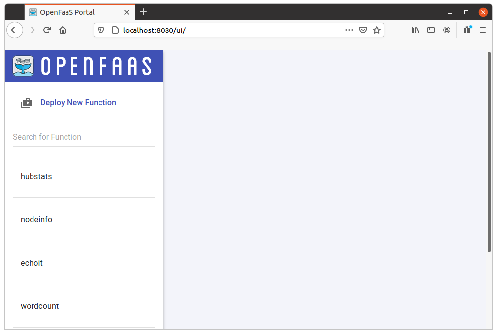
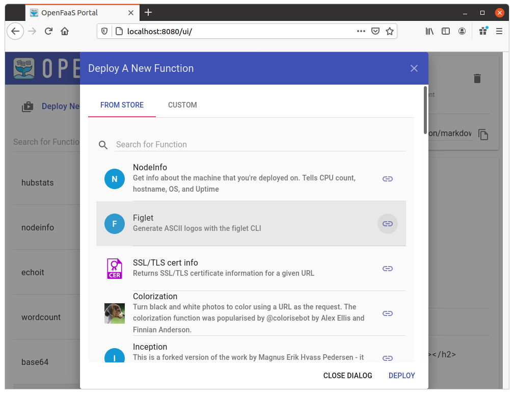
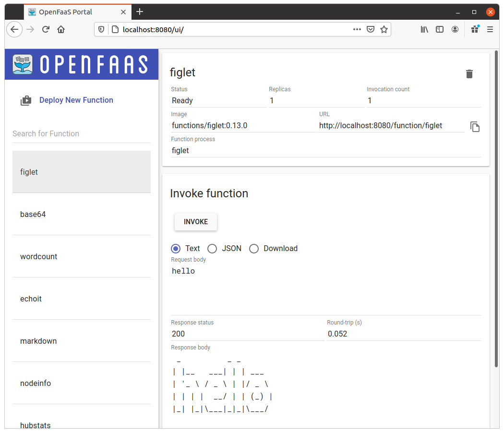

# Lab 2 - Test things out

</img>

在開始這個lab之前，請為lab2在本機上創建一個新文件夾:

```sh
$ mkdir -p lab2 \
   && cd lab2
```

## Use the UI Portal

現在，你可以測試一下OpenFaaS UI:

如果你在本機的環境變數上己經設置`$OPENFAAS_URL`，那麼把它打印出來然後使用瀏覽器來連接它:

```sh
echo $OPENFAAS_URL
http://localhost:8080
```

如果你尚未設置`$OPENFAAS_URL`，則預設值為: [http://127.0.0.1:8080](http://127.0.0.1:8080)。

我們可以部署一些官方版本的範例functions，然後使用它們來進行測試:

```sh
$ faas-cli deploy -f https://raw.githubusercontent.com/openfaas/faas/master/stack.yml
```

你應該在左側的功能列表上看到許多被部署上去的functions列表。



你可以在用戶界面中試用它們，例如Markdown，該function將Markdown文件轉換為HTML。

在*Request*欄位中輸入以下內容：

```sh
## The **OpenFaaS** _workshop_
```

現在點擊*Invoke*，然後看到response出現在屏幕的下半部分。

例如:

```sh
<h2>The <strong>OpenFaaS</strong> <em>workshop</em></h2>
```

在UI上你將看到一些有用的訊息:
* Status - 該function是否已準備好運行。在狀態顯示“Ready”之前，你將無法從UI調用該function。
* Replicas - 在集群中運行的function實例的副本數量
* Image - 發佈到Docker Hub或Docker repository的Docker映像名稱和版本
* Invocation count - 它顯示了該function被調用多少次數的統計值，並且每5秒更新一次

你可試著多次地去點擊*Invoke*，然後看到*Invocation count*會持續跟著增加。


## Deploy via the Function Store

你可以從OpenFaaS store來部署一些functions。該store是社群貢獻的免費functions的收集。

* 點擊 *Deploy New Function*
* 點擊 *From Store*
* 點擊 *Figlet* 或在搜索欄鍵入 *figlet* 並且點擊 *Deploy*



`Figlet`將出現在UI左側功能列表中。請等待一些時間讓function的映像從Docker Hub下載並部署，當狀態變成"Ready"之後鍵入一些文句（例如'hello'），然後像對Markdown一樣點擊"Invoke"。

你會看到這樣生成的ASCII log:

```sh
 _          _ _       
| |__   ___| | | ___  
| '_ \ / _ \ | |/ _ \ 
| | | |  __/ | | (_) |
|_| |_|\___|_|_|\___/ 
                      
```



## Learn about the CLI

接下來我們要測試OpenFaas的CLI，首先要注意OpenFaaS網關URL的設定。

如果你的*gateway*不是部署在`http://127.0.0.1:8080`上，那麼你將需要指定OpenFaaS Gateway的位置。有幾種方法可以達到此目的:

1. 設置環境變數`OPENFAAS_URL`，`faas-cli`將指向你當前Shell會話中的該端點。例如：`export OPENFAAS_URL=http://localhost:8080`。如果你遵循了[Lab 1](./lab1.md)的步驟，那麼相關的設定己經就序了。
2. 用`-g`或`--gateway`引數來標定正確的聯接端點: `faas-cli deploy --gateway http://openfaas.endpoint.com:8080`
3. 在你的function部署YAML文件中，更改`provider:`之下`gateway:`對象指定的值(在之後的lab會展示具體做法)。

### List the deployed functions

下列的命令會顯示有多少個functions副本以及調用計數。

```sh
$ faas-cli list

Function                      	Invocations    	Replicas
base64                        	0              	1    
wordcount                     	0              	1    
echoit                        	0              	1    
markdown                      	0              	1    
nodeinfo                      	0              	1    
hubstats                      	0              	1    
figlet                        	1              	1  
```

你應該看到*markdown*與*figlet* 與調用它們的次數被條列出來。

現在再嘗試一下使用verbose旗標:

```sh
$ faas-cli list --verbose

Function                      	Image                                   	Invocations    Replicas
base64                        	functions/alpine:latest                 	0              1    
wordcount                     	functions/alpine:latest                 	0              1    
echoit                        	functions/alpine:latest                 	0              1    
markdown                      	functions/markdown-render:latest        	0              1    
nodeinfo                      	functions/nodeinfo:latest               	0              1    
hubstats                      	functions/hubstats:latest               	0              1    
figlet                        	functions/figlet:0.13.0                 	1              1    
```

或是:

```sh
$ faas-cli list -v

Function                      	Image                                   	Invocations    	Replicas
base64                        	functions/alpine:latest                 	0              	1    
wordcount                     	functions/alpine:latest                 	0              	1    
echoit                        	functions/alpine:latest                 	0              	1    
markdown                      	functions/markdown-render:latest        	0              	1    
nodeinfo                      	functions/nodeinfo:latest               	0              	1    
hubstats                      	functions/hubstats:latest               	0              	1    
figlet                        	functions/figlet:0.13.0                 	1              	1    
```

現在，你可以看到這些function的Docker映像以及function名稱。

### Invoke a function

選擇出現在`faas-cli list`上的function，例如`markdown`:

```sh
$ faas-cli invoke markdown
```

現在terminal將要求你輸入一些語句。完成後，按`Control + D`。


另外，你可以執行諸如`echo`或`uname -a`之類的命令並將其輸出的結果作為（通過pipe串接）`invoke`命令的輸入。

```sh
$ echo Hi | faas-cli invoke markdown

$ uname -a | faas-cli invoke markdown
```


你甚至可以使用本次lab2.md的內容來生成HTML文件：

```sh
$ git clone https://github.com/openfaas/workshop \
   && cd workshop

$ cat lab2.md | faas-cli invoke markdown
```


## Monitoring dashboard

OpenFaaS使用Prometheus自動跟踪你部建functions的指標。OpenFaaS使用[Grafana](https://grafana.com)的免費開源工具將這些指標變成有用的儀表板。

使用_Kubernetes_來部署OpenFaaS的Grafana。

在OpenFaaS Kubernetes的命名空間中運行Grafana:

```sh
kubectl -n openfaas run \
--image=stefanprodan/faas-grafana:4.6.3 \
--port=3000 \
grafana
```

使用NodePort公開Grafana連接端口:

```sh
kubectl -n openfaas expose pod grafana \
--type=NodePort \
--name=grafana
```

查找Grafana節點端口地址:

```sh
$ GRAFANA_PORT=$(kubectl -n openfaas get svc grafana -o jsonpath="{.spec.ports[0].nodePort}")
$ GRAFANA_URL=http://IP_ADDRESS:$GRAFANA_PORT/dashboard/db/openfaas
```

其中`IP_ADDRESS`是你對應的Kubernetes IP。

或者你可以運行port-forwarding命令以便能夠使用`http://127.0.0.1:3000`訪問到Grafana:

```sh
$ kubectl port-forward pod/grafana 3000:3000 -n openfaas
```


創建服務後，在瀏覽器中打開Grafana，使用用戶名`admin`和密碼`admin`登錄並導航至以下預建的OpenFaaS儀表板:


從左上方搜索下拉菜單中找到_OpenFaaS_儀表板 `Home -> OpenFaaS`。


*圖為：Grafana的OpenFaaS儀表板範例*

下一步 >> [Lab 3](./lab3_zh-tw.md)