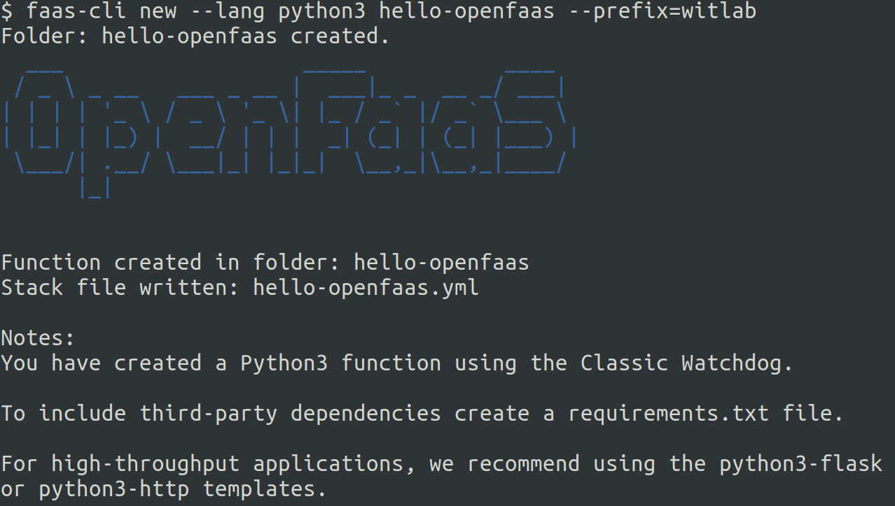
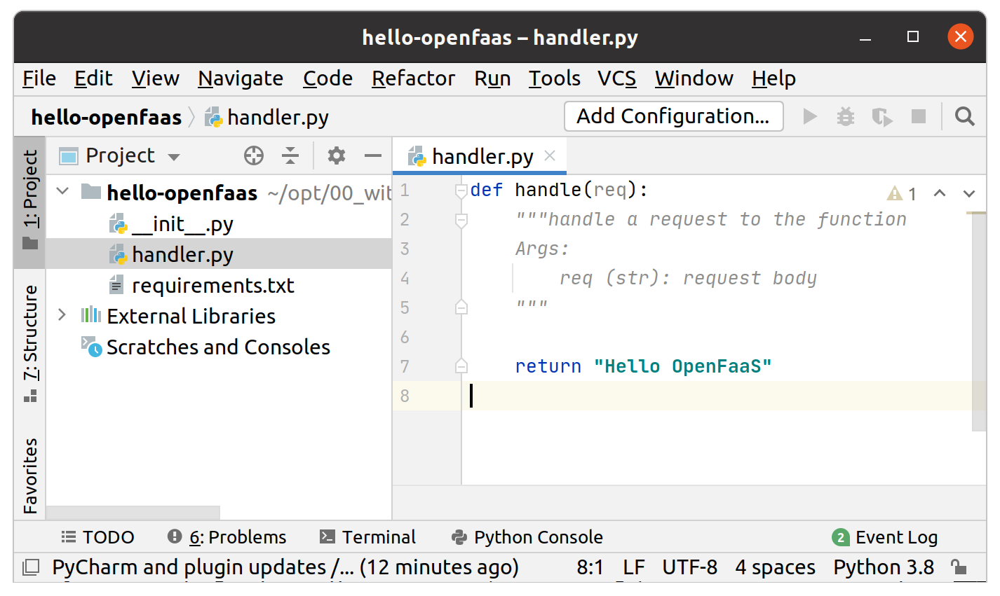
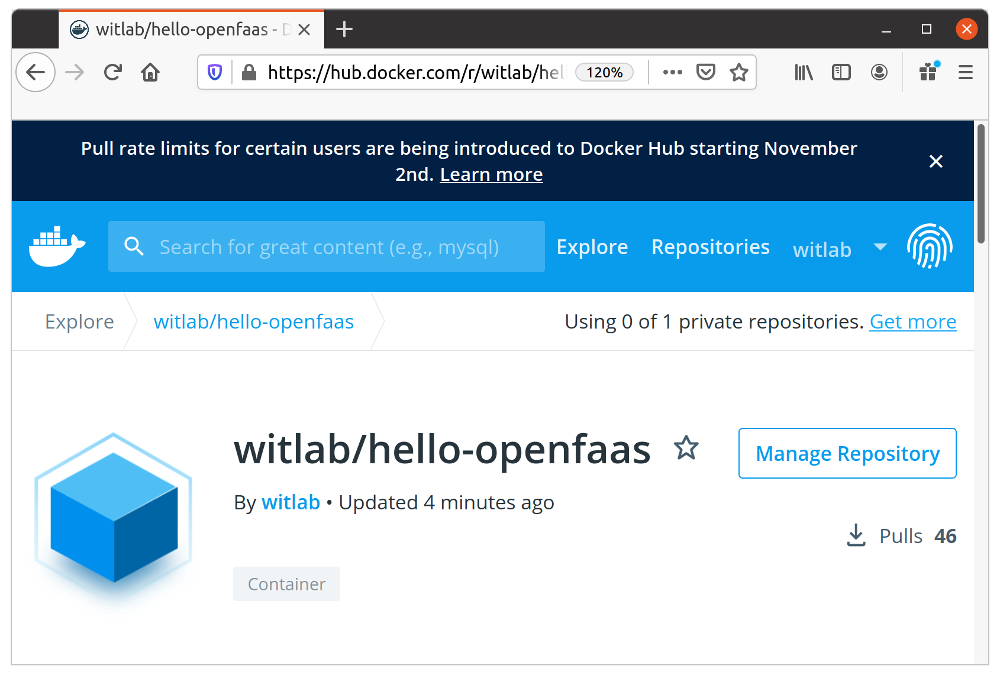
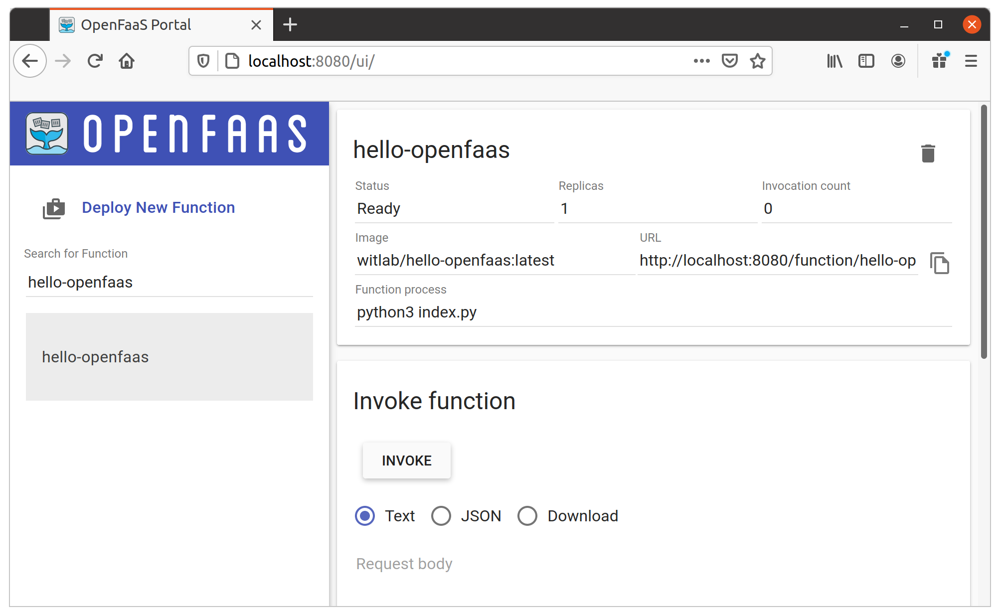
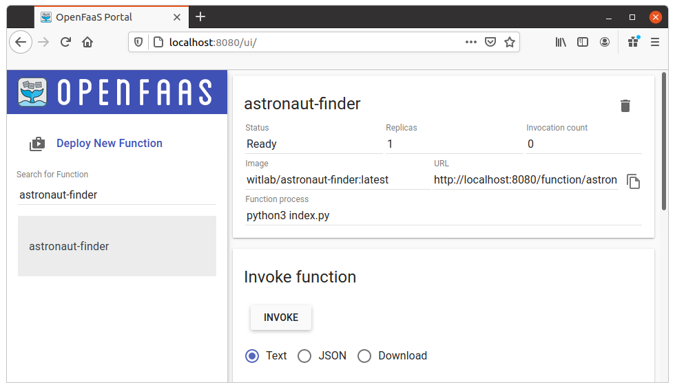
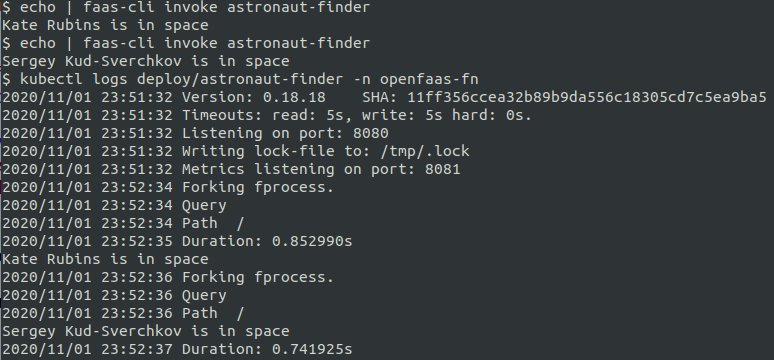
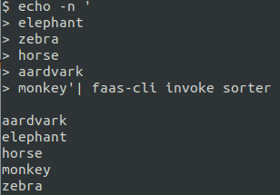

# Lab 3 - Introduction to functions

[Chinses version](lab3_zh-tw.md)

</img>

Before starting this lab, create a new folder for your files:

```sh
$ mkdir -p lab3 \
   && cd lab3
```

## Creating a new function

There are two ways to create a new function:

* scaffold a function using a built-in or community code template (default)
* take an existing binary and use it as your function (advanced)

### Scaffold or generate a new function

Before creating a new function from a template make sure you pull the [templates from GitHub](https://github.com/openfaas/templates):

```sh
$ faas-cli template pull

Fetch templates from repository: https://github.com/openfaas/templates.git at master
Attempting to expand templates from https://github.com/openfaas/templates.git
Fetched 12 template(s) : [csharp dockerfile go java11 java11-vert-x node node12 php7 python python3 python3-debian ruby] from https://github.com/openfaas/templates.git

```

After that, to find out which languages are available type in:

```sh
$ faas-cli new --list

Languages available as templates:
- csharp
- dockerfile
- go
- java11
- java11-vert-x
- node
- node12
- php7
- python
- python3
- python3-debian
- ruby
```

Or alternatively create a folder containing a `Dockerfile`, then pick the "Dockerfile" lang type in your YAML file.

If you are curious about how these tempates works, you can check the directory after template pulling. You can find `template` folder is created with below directory tree structure:

```sh
template
    ├── csharp
    ├── dockerfile
    ├── go
    ├── java11
    ├── java11-vert-x
    ├── node
    ├── node12
    ├── php7
    ├── python
    ├── python3
    ├── python3-debian
    └── ruby

```

Look into each language folder and get a sense of how `faas-cli` scaffolding works.

Let's take a deeper look into `template\python3` folder:

```sh
python3
├── Dockerfile
├── function
│   ├── handler.py
│   ├── __init__.py
│   └── requirements.txt
├── index.py
├── requirements.txt
└── template.yml
```

* index.py - the entry point of function which take stdin as input and dispatch to handler.py, then print the result to stdout
* Dockerfile - How the function is packaged

At this point you can create a new function for Python, Python 3, Ruby, Go, Node, CSharp etc.

* A note on our examples

All of our examples for this workshop have been thoroughly tested by the OpenFaaS community with *Python 3*, but should be compatible with *Python 2.7* also.

If you'd prefer to use Python 2.7 instead of Python 3 then swap `faas-cli new --lang python3` for `faas-cli new --lang python`.

### Hello world in Python

We will create a hello-world function in Python, then move onto something that uses additional dependencies too.

* Scaffold the function

```sh
$ faas-cli new --lang python3 hello-openfaas --prefix="<your-docker-username-here>"
```


The `--prefix` parameter will update `image: ` value in `hello-openfaas.yml` with a prefix which should be your Docker Hub account. For [OpenFaaS](https://hub.docker.com/r/functions) this is `image: functions/hello-openfaas` and the parameter will be `--prefix="functions"`.

If you don't specify a prefix when you create the function then edit the YAML file after creating it.

This will create three files and a directory:

```sh
./hello-openfaas.yml
./hello-openfaas
./hello-openfaas/handler.py
./hello-openfaas/requirements.txt
```

The YAML (.yml) file is used to configure the CLI for building, pushing and deploying your function.

> Note: Whenever you need to deploy a function on Kubernetes or on a remote OpenFaaS instance you must always push your function after building it. In this case you can also override the default gateway URL of `127.0.0.1:8080` with an environmental variable: `export OPENFAAS_URL=127.0.0.1:8080`.

Here's the contents of the YAML file (`hello-openfaas.yml`):

```yaml
provider:
  name: openfaas
  gateway: http://127.0.0.1:8080

functions:
  hello-openfaas:
    lang: python3
    handler: ./hello-openfaas
    image: <your-docker-username>/hello-openfaas
```

* The name of the function is represented by the key under `functions` i.e. `hello-openfaas`
* The language is represented by the `lang` field
* The folder used to build from is called `handler`, this must be a folder not a file
* The Docker image name to be used is under the field `image`

Remember that the `gateway` URL can be overriden in the YAML file (by editing the `gateway:` value under `provider:`) or on the CLI (by using `--gateway` or setting the `OPENFAAS_URL` environment variable).

Here is the contents of the `handler.py` file:

```python
def handle(req):
    """handle a request to the function
    Args:
        req (str): request body
    """

    return req
```

This function will just return the input, so it's effectively an `echo` function.

Edit the message so it returns `Hello OpenFaaS` instead i.e.

```sh
    return "Hello OpenFaaS"
```



Any values returned to stdout will subsequently be returned to the calling program. Alternatively a `print()` statement could be employed which would exhibit a similar flow through to the calling program.

This is the local developer-workflow for functions:

```sh
$ faas-cli up -f hello-openfaas.yml

[0] > Building hello-openfaas.
Clearing temporary build folder: ./build/hello-openfaas/
Preparing: ./hello-openfaas/ build/hello-openfaas/function
Building: witlab/hello-openfaas:latest with python3 template. Please wait..
Sending build context to Docker daemon  18.43kB
Step 1/29 : FROM openfaas/classic-watchdog:0.18.18 as watchdog
 ---> 8aa8fb60b8b9
Step 2/29 : FROM python:3-alpine
 ---> 55d14c2b2fc1
...
...
Step 29/29 : CMD ["fwatchdog"]
 ---> Using cache
 ---> c87d8334beeb
Successfully built c87d8334beeb
Successfully tagged witlab/hello-openfaas:latest
Image: witlab/hello-openfaas:latest built.
[0] < Building hello-openfaas done in 0.19s.
[0] Worker done.

Total build time: 0.19s

[0] > Pushing hello-openfaas [witlab/hello-openfaas:latest].
The push refers to repository [docker.io/witlab/hello-openfaas]
...
...
latest: digest: sha256:ef9624d8a7e00ae714a678594bd42cc4807a571e9492527aa0019e32f6c25fb1 size: 4282
[0] < Pushing hello-openfaas [witlab/hello-openfaas:latest] done.
[0] Worker done.

Deploying: hello-openfaas.
WARNING! Communication is not secure, please consider using HTTPS. Letsencrypt.org offers free SSL/TLS certificates.

Deployed. 202 Accepted.
URL: http://127.0.0.1:8080/function/hello-openfaas.openfaas-fn
```

Verify if the docker iamge has been built and pushed to docker hub:



Verify if the `hello-openfaas` function has been deployed to OpenFaaS:



> Note: Please make sure that you have logged in to docker registry with `docker login` command before running this command.

> Note: `faas-cli up` command combines build, push and deploy commands of `faas-cli` in a single command.

Followed by invoking the function via the UI, CLI, `curl` or another application.

The function will always get a route, for example:

```sh
$OPENFAAS_URL/function/<function_name>
$OPENFAAS_URL/function/figlet
$OPENFAAS_URL/function/hello-openfaas
```

> Pro-tip: if you rename your YAML file to `stack.yml` then you need not pass the `-f` flag to any of the commands.

Functions can be invoked via a `GET` or `POST` method only.

* Invoke your function

Test out the function with `faas-cli invoke`, check `faas-cli invoke --help` for more options.

```sh
$ echo "" | faas-cli invoke hello-openfaas

Hello OpenFaaS
```

### Example function: astronaut-finder

We'll create a function called `astronaut-finder` that pulls in a random name of someone in space aboard the International Space Station (ISS).

```sh
$ faas-cli new --lang python3 astronaut-finder --prefix="<your-docker-username-here>"
```


This will write three files for us:

```sh
./astronaut-finder/handler.py
```

The handler for the function - you get a `req` object with the raw request and can print the result of the function to the console.

```sh
./astronaut-finder/requirements.txt
```

Use this file to list any `pip` modules you want to install, such as `requests` or `urllib`

```sh
./astronaut-finder.yml
```

This file is used to manage the function - it has the name of the function, the Docker image and any other customisations needed.

* Edit `./astronaut-finder/requirements.txt`

```sh
requests
```

This tells the function it needs to use a third-party module named [requests](http://docs.python-requests.org/en/master/) for accessing websites over HTTP.

* Write the function's code:

We'll be pulling in data from: http://api.open-notify.org/astros.json

Here's an example of the result:

```json
{
  "message": "success",
  "people": [
    {
      "name": "Sergey Ryzhikov",
      "craft": "ISS"
    },
    {
      "name": "Kate Rubins",
      "craft": "ISS"
    },
    {
      "name": "Sergey Kud-Sverchkov",
      "craft": "ISS"
    }
  ],
  "number": 3
}
```

Update `handler.py`:

```python
import requests
import random

def handle(req):
    r = requests.get("http://api.open-notify.org/astros.json")
    result = r.json()
    index = random.randint(0, len(result["people"])-1)
    name = result["people"][index]["name"]

    return "%s is in space" % (name)
```


> Note: in this example we do not make use of the parameter `req` but must keep it in the function's header.

Now build the function:

```sh
$ faas-cli build -f ./astronaut-finder.yml

[0] > Building astronaut-finder.
Clearing temporary build folder: ./build/astronaut-finder/
Preparing: ./astronaut-finder/ build/astronaut-finder/function
Building: witlab/astronaut-finder:latest with python3 template. Please wait..
Sending build context to Docker daemon  18.94kB
Step 1/29 : FROM openfaas/classic-watchdog:0.18.18 as watchdog
 ---> 8aa8fb60b8b9
Step 2/29 : FROM python:3-alpine
 ---> 55d14c2b2fc1
Step 3/29 : ARG ADDITIONAL_PACKAGE
...
...
Successfully built de571855eba5
Successfully tagged witlab/astronaut-finder:latest
Image: witlab/astronaut-finder:latest built.
[0] < Building astronaut-finder done in 7.75s.
[0] Worker done.

Total build time: 7.75s
```

You should be able to find the new docker image:

```sh
$ docker image list | grep astronaut-finder

witlab/astronaut-finder      latest              de571855eba5        5 minutes ago       68.4MB
```

> Tip: Try renaming astronaut-finder.yml to `stack.yml` and calling just `faas-cli build`. `stack.yml` is the default file-name for the CLI.

Push the function:

```sh
$ faas-cli push -f ./astronaut-finder.yml

[0] > Pushing astronaut-finder [witlab/astronaut-finder:latest].
The push refers to repository [docker.io/witlab/astronaut-finder]
4a627f133970: Pushed 
2677a3734478: Pushed 
...
...
f54730c4d0af: Layer already exists 
408e53c5e3b2: Layer already exists 
50644c29ef5a: Layer already exists 
latest: digest: sha256:358c68414b9c3fa7e691924951e0f88f4ba1c7b9362214111bb7a444903865ce size: 4289
[0] < Pushing astronaut-finder [witlab/astronaut-finder:latest] done.
[0] Worker done.
```


Deploy the function:

```sh
$ faas-cli deploy -f ./astronaut-finder.yml

Deploying: astronaut-finder.

Deployed. 202 Accepted.
URL: http://127.0.0.1:8080/function/astronaut-finder.openfaas-fn
```



Invoke the function

```sh
$ echo | faas-cli invoke astronaut-finder

Kate Rubins is in space

$ echo | faas-cli invoke astronaut-finder

Sergey Ryzhikov is in space
```

## Troubleshooting: find the container's logs

You can find out high-level information on every invocation of your function via the container's logs:

```sh
$ kubectl logs deployment/astronaut-finder -n openfaas-fn
```


## Troubleshooting: verbose output with `write_debug`

Let's turn on verbose output for your function. This is turned-off by default so that we do not flood your function's logs with data - that is especially important when working with binary data which makes no sense in the logs.

This is the standard YAML configuration:

```yaml
provider:
  name: openfaas
  gateway: http://127.0.0.1:8080

functions:
  astronaut-finder:
    lang: python3
    handler: ./astronaut-finder
    image: <your-docker-username>/astronaut-finder
```

Edit your YAML file for the function and add an "environment" section.

```yaml
  astronaut-finder:
    lang: python3
    handler: ./astronaut-finder
    image: <your-docker-username>/astronaut-finder
    environment:
      write_debug: true
```

Now deploy your function again with `faas-cli deploy -f ./astronaut-finder.yml`.

Invoke the function and then checkout the logs again to view the function responses:

```sh
$ kubectl logs deployment/astronaut-finder -n openfaas-fn
```



### Managing multiple functions

The YAML file for the CLI allows functions to be grouped together into stacks, this is helpful when working with a set of related functions.

To see how this works generate two functions:

```sh
$ faas-cli new --lang python3 first
```

For the second function use the `--append` flag:

```sh
$ faas-cli new --lang python3 second --append=./first.yml
```

For convenience let's rename `first.yml` to `example.yml`.

```sh
$ mv first.yml example.yml
```

Now look at the file:

```yaml
provider:
  name: openfaas
  gateway: http://127.0.0.1:8080

functions:
  first:
    lang: python3
    handler: ./first
    image: <your-docker-username>/first
  second:
    lang: python3
    handler: ./second
    image: <your-docker-username>/second
```

Here are several flags that help when working with a stack of functions:

* Build in parallel:

```sh
$ faas-cli build -f ./example.yml --parallel=2
```

* Build / push only one function:

```sh
$ faas-cli build -f ./example.yml --filter=second
```

Take a few moments to explore the options for `build`, `push` and `deploy`.

* `faas-cli build --help`
* `faas-cli push --help`
* `faas-cli deploy --help`

To run `faas-cli build && faas-cli push && faas-cli deploy` together, use `faas-cli up` instead.

> Pro-tip: `stack.yml` is the default name the faas-cli will look for if you don't want to pass a `-f` parameter.

You can also deploy remote function stack (yaml) files over HTTP(s) using `faas-cli deploy -f https://....`.

### Custom templates

If you have your own set of forked or custom templates, then you can pull them down for use with the CLI.

Here's an example of fetching a Python 3 template which uses Debian Linux.

Pull the template using the `git` URL:

```sh
$ faas-cli template pull https://github.com/openfaas-incubator/python3-debian
```

Now type in: `faas-cli new --list`

```sh
$ faas-cli new --list | grep python
- python
- python3
- python3-debian
```

These new templates are saved in your current working directory in `./templates/`.

#### Custom templates: Template Store

The *Template Store* is a similar concept to the *Function Store*, it enables users to collaborate by sharing their templates. The template store also means that you don't have to remember any URLs for making use of your favourite community or project templates.

You can Search and discover templates using the following two commands:

```sh
$ faas-cli template store list
$ faas-cli template store list -v

NAME                     SOURCE             DESCRIPTION
csharp                   openfaas           Official C# template
dockerfile               openfaas           Official Dockerfile template
go                       openfaas           Official Golang template
...
```

To get more details you can use the `--verbose` flag, or the `describe` command.

Let's get a template for use with Node.js which is powered by the Express.js framework.

```sh
$ faas-cli template store describe node10-express

Name:              node10-express
Platform:          x86_64
Language:          NodeJS
Source:            openfaas-incubator
Description:       NodeJS 10 Express template
Repository:        https://github.com/openfaas-incubator/node10-express-template
Official Template: true
```

Pull the template down:

```sh
$ faas-cli template store pull node10-express
```

You can now type in `faas-cli new --lang node10-express`.

See also: [Function & Template Store](https://github.com/openfaas/store/)

### Variable Substitution in YAML File (optional exercise)

The `.yml` file used to configure the CLI is capable of variable substitution so that you are able to use the same `.yml` file for multiple configurations.

One example of where this can be useful is when there are different registries for development and production images. You can use the variable substitution so that local and test environments use the default account, and the CI server can be configured to use the production account.

> This is provided by the [envsubst library](https://github.com/drone/envsubst). Follow the link to see examples of supported variables

Edit your `astronaut-finder.yml` to match the following:

```yml
  astronaut-finder:
    lang: python3
    handler: ./astronaut-finder
    image: ${DOCKER_USER:-development}/astronaut-finder
    environment:
      write_debug: true
```

You'll notice the `image` property has been updated to include a variable definition (`DOCKER_USER`). That value will be replaced with the value of the environment variable with the same name. If the environment variable is not present, or is empty, the default value (`development`) will be used.

The variable will be replaced with the value throughout the file. So, if you have several functions in your `.yml` file, all references to the `DOCKER_USER` variable will be replaced with the value of that environment variable

Run the following command and observe the output:

`faas-cli build -f ./astronaut-finder.yml`

The output should show that the image built is labeled as `development/astronaut-finder:latest`

Now, set the environment variable to your Docker Hub account name (for the example, we'll use the OpenFaaS "functions" account)

```sh
export DOCKER_USER=functions
```

Run the same build command as before and observe the output:

`faas-cli build -f ./astronaut-finder.yml`

The output should now show that the image was built with the updated label `functions/astronaut-finder:latest`

### Custom binaries as functions (optional exercise)

Custom binaries or containers can be used as functions, but most of the time using the language templates should cover all the most common scenarios.

To use a custom binary or Dockerfile create a new function using the `dockerfile` language:

```sh
$ faas-cli new --lang dockerfile sorter --prefix="<your-docker-username-here>"
```


You'll see a folder created named `sorter` and `sorter.yml`.

Edit `sorter/Dockerfile` and update the line which sets the `fprocess`. Let's change it to the built-in bash command of `sort`. We can use this to sort a list of strings in alphanumeric order.

```dockerfile
ENV fprocess="sort"
```


Now build, push and deploy the function:

```sh
$ faas-cli up -f sorter.yml
```

Now invoke the function through the UI or via the CLI:

```sh
$ echo -n '
elephant
zebra
horse
aardvark
monkey'| faas-cli invoke sorter

aardvark
elephant
horse
monkey
zebra
```



In the example we used `sort` from [BusyBox](https://busybox.net/downloads/BusyBox.html) which is built into the function. There are other useful commands such as `sha512sum` and even a `bash` or shell script, but you are not limited to these built-in commands. Any binary or existing container can be made a serverless function by adding the OpenFaaS function watchdog.

> Tip: did you know that OpenFaaS supports Windows binaries too? Like C#, VB or PowerShell?

Now move onto [Lab 4](lab4.md)