# Lab 5 - Create a GitHub bot

</img>

Before starting this lab, create a new folder for your files:

```
$ mkdir -p lab5 \
   && cd lab5
```

We're going to use OpenFaaS functions to create a GitHub bot named `issue-bot`.

The job of issue-bot is to triage new issues by analysing the sentiment of the "description" field, it will then apply a label of *positive* or *review*. This will help the maintainers with their busy schedule so they can prioritize which issues to look at first.


## Get a GitHub account

* Sign up for a [GitHub account](https://github.com) if you do not already have one.

* Create a new repository and call it *bot-tester*

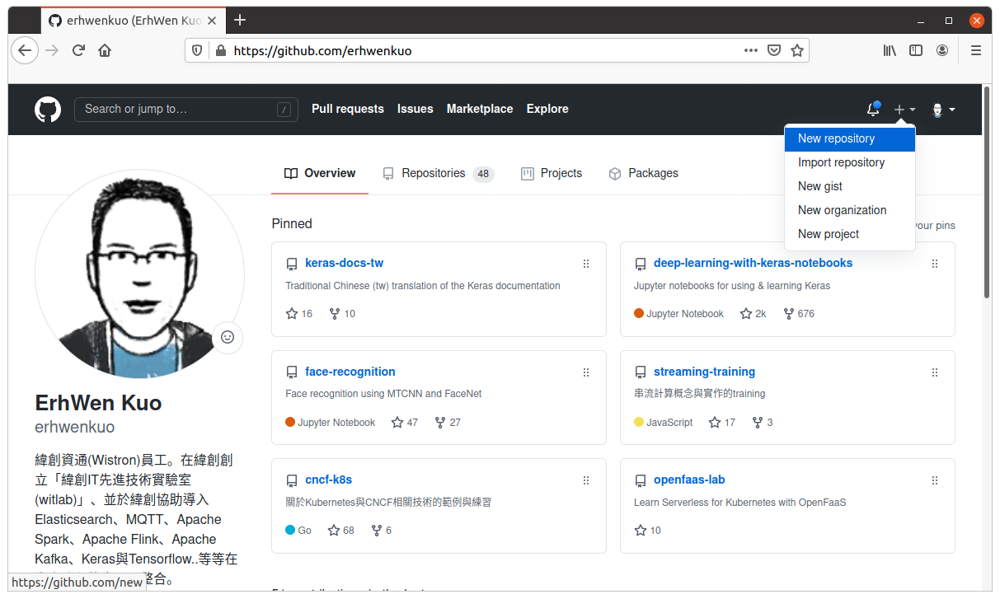


Note: we will only use this repository as a testing ground for creating Issues. You don't need to commit any code there.

## Create a webhook receiver `issue-bot`

```
$ faas-cli new --lang python3 issue-bot --prefix="<your-docker-username-here>"
```


Now edit the function's YAML file `issue-bot.yml` and add an environmental variable of `write_debug: true`:

```
provider:
  name: openfaas
  gateway: http://127.0.0.1:8080

functions:
  issue-bot:
    lang: python3
    handler: ./issue-bot
    image: <user-name>/issue-bot
    environment:
      write_debug: true
```

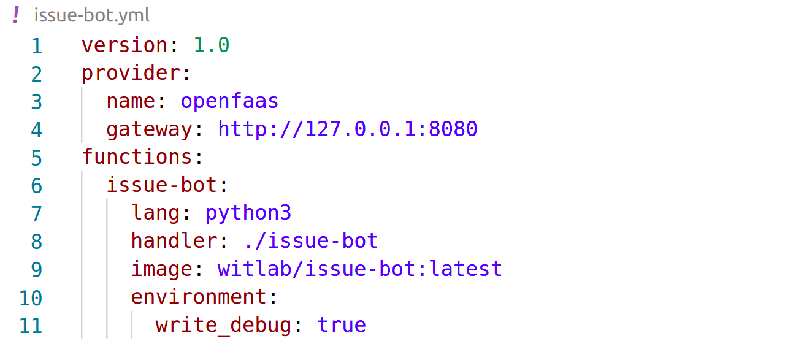

The `handler.py` is like a `echo` function:

```python
def handle(req):
    """handle a request to the function
    Args:
        req (str): request body
    """

    return req
```

* Build, push and deploy the function with

```
$ faas-cli up -f ./issue-bot.yml

[0] > Building issue-bot.
Clearing temporary build folder: ./build/issue-bot/
Preparing: ./issue-bot/ build/issue-bot/function
Building: witlab/issue-bot:latest with python3 template. Please wait..
Sending build context to Docker daemon  9.216kB
Step 1/29 : FROM openfaas/classic-watchdog:0.18.18 as watchdog
 ---> 8aa8fb60b8b9
Step 2/29 : FROM python:3-alpine

...
...
 ---> b5653cb5e8d6
Successfully built b5653cb5e8d6
Successfully tagged witlab/issue-bot:latest
Image: witlab/issue-bot:latest built.
[0] < Building issue-bot done in 0.17s.
[0] Worker done.

Total build time: 0.17s

[0] > Pushing issue-bot [witlab/issue-bot:latest].
The push refers to repository [docker.io/witlab/issue-bot]
d7f4bf09ab52: Mounted from witlab/hello-python 

...
...
latest: digest: sha256:3deb8d071f527768d46163a63d36a63d77dfe973f976abc105154ecd6bc1fea6 size: 4281
[0] < Pushing issue-bot [witlab/issue-bot:latest] done.
[0] Worker done.

Deploying: issue-bot.
WARNING! Communication is not secure, please consider using HTTPS. Letsencrypt.org offers free SSL/TLS certificates.

Deployed. 202 Accepted.
URL: http://127.0.0.1:8080/function/issue-bot.openfaas-fn
```

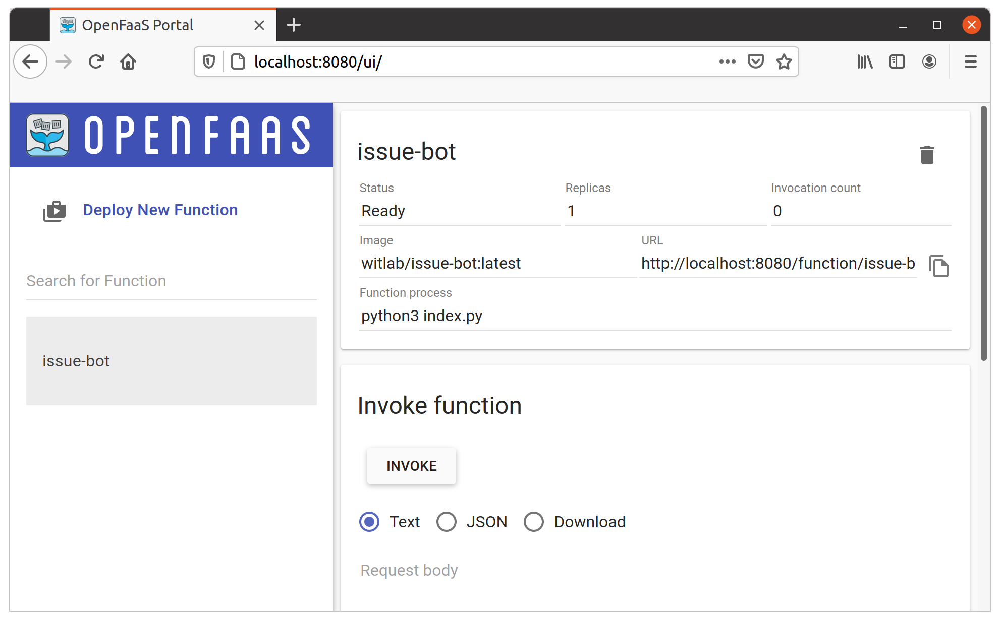

Testing the function using `curl`:

```sh
curl -X POST http://localhost:8080/function/issue-bot -d '{"test":"hello world"}'
```


Let's check the debug log:

```sh
$ kubectl logs deploy/issue-bot -n openfaas-fn
```


## Set up a tunnel with ngrok

You will need to receive incoming webhooks from GitHub. In production you will have a clear route for incoming traffic but within the constraints of a workshop we have to be creative.

We are going to use [ngrok](https://ngrok.com/) to build a http tunnel with out local function. Follow the [Download & setup ngrok](https://ngrok.com/download) to install `ngrok` on local machine. 

Open a new Terminal and type in:
```
$ ngrok http 8080

ngrok by @inconshreveable                                              (Ctrl+C to quit)
                                                                                       
Session Status                online                                                   
Session Expires               7 hours, 58 minutes                                      
Version                       2.3.35                                                   
Region                        United States (us)                                       
Web Interface                 http://127.0.0.1:4040                                    
Forwarding                    http://134dbb8d227d.ngrok.io -> http://localhost:8080    
Forwarding                    https://134dbb8d227d.ngrok.io -> http://localhost:8080   
                                                                                       
Connections                   ttl     opn     rt1     rt5     p50     p90              
                              0       0       0.00    0.00    0.00    0.00 
```


`ngrok` provide free http network tunning, however each session will only last 8 hours and URL for traffic forwarding will change each time you execute `ngrok`.

Base on console out of `ngrok`, you should be able to know the public URL(i.e: http://134dbb8d227d.ngrok.io) for web hooking.

> Note: the URL `ngrok` provided will be changed, make sure you find your own URL!

Testing the `ngrok` traffic tunneling using `curl`:

```sh
curl -X POST http://134dbb8d227d.ngrok.io/function/issue-bot -d '{"test":"hello from ngrok"}'
```


## Receive webhooks from GitHub

Log back into GitHub and navigate to your repository *bot-tester*

Click *Settings* -> *Webhooks* -> *Add Webhook*


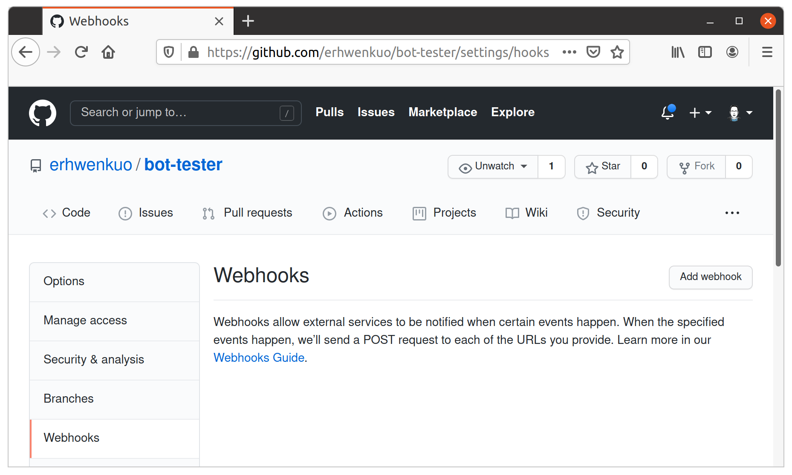

Now enter the URL you were given from `ngrok` adding `/function/issue-bot` to the end, for example:

```
http://134dbb8d227d.ngrok.io/function/issue-bot
```


* For *Content-type* select: *application/json*

* Leave *Secret* blank for now.

* And select "Let me select individual events"

* For events select **Issues** and **Issue comment**


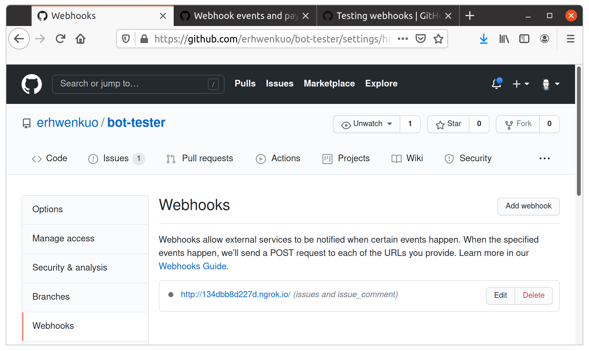

## Check it worked

Now go to GitHub and create a new issue. Type "test" for the title and description.

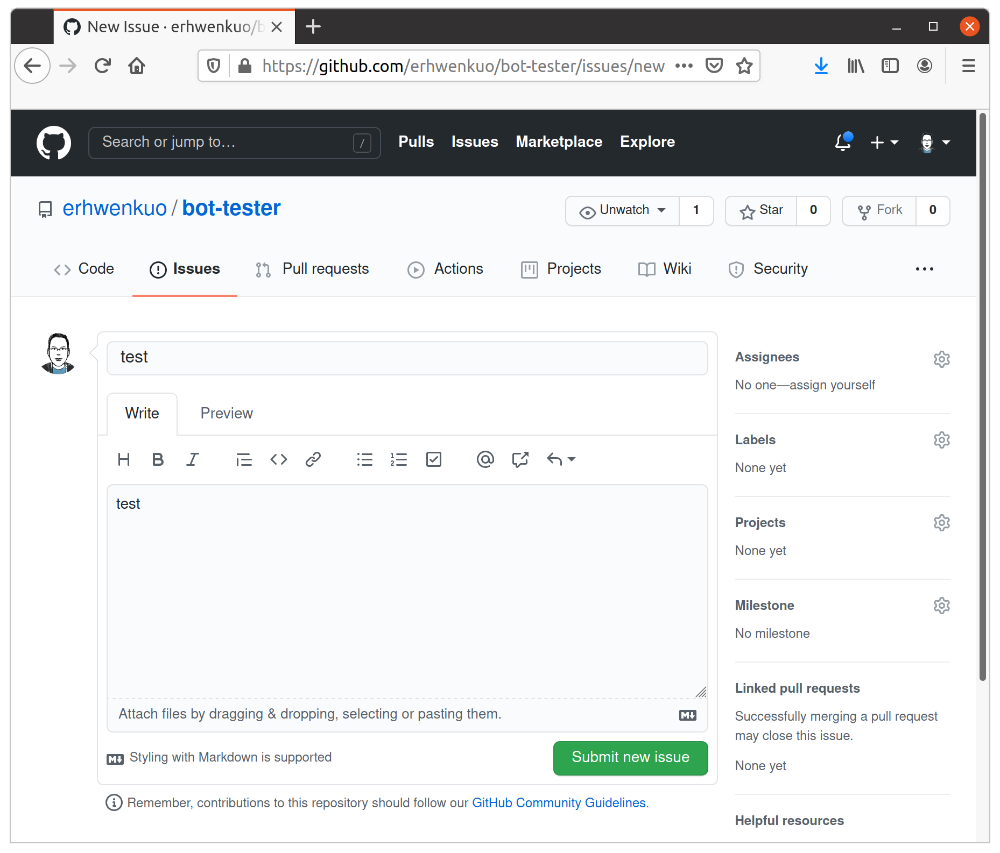


Check how many times the function has been called - this number should be at least `1`.

```
$ faas-cli list
Function    Invocations
issue-bot   2
```

Each time you create an issue the count will increase due to GitHub's API invoking the function.

You can see the payload sent via GitHub by typing in:

```sh
$ kubectl logs deployment/issue-bot -n openfaas-fn
```
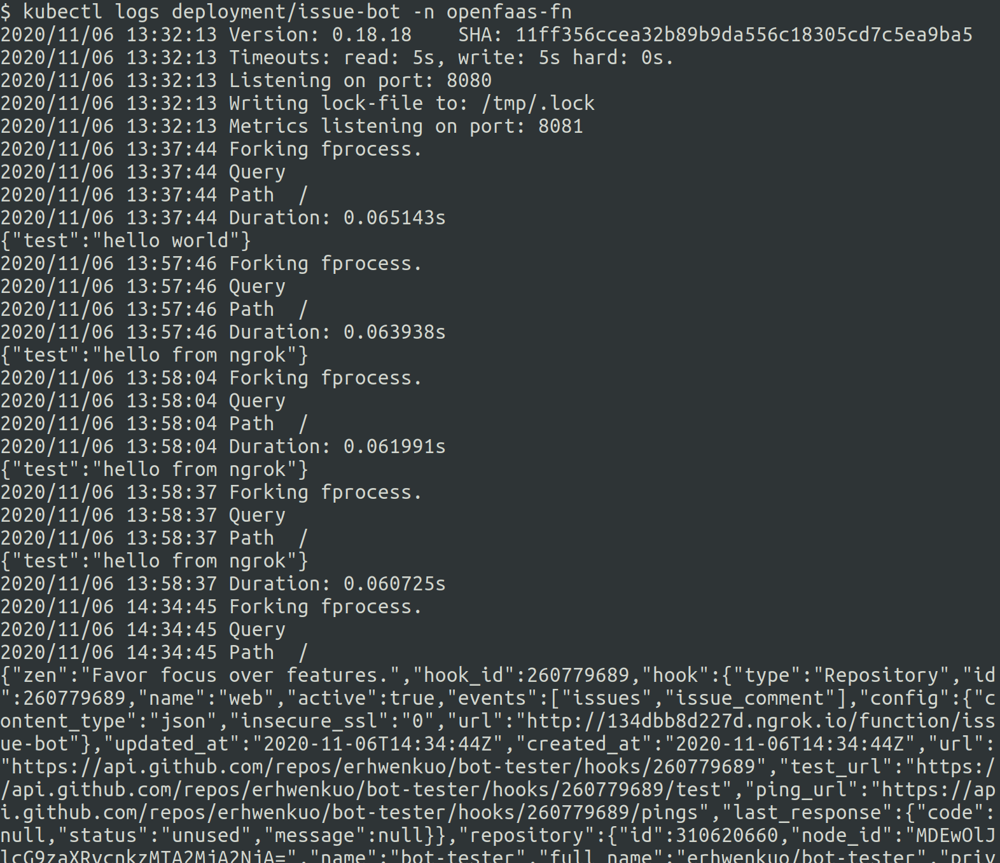

The GitHub Webhooks page will also show every message sent under "Recent Deliveries", you can replay a message here and see the response returned by your function.


### Deploy SentimentAnalysis function

In order to use this issue-bot function, you will need to deploy the SentimentAnalysis function first.
This is a python function that provides a rating on sentiment positive/negative (polarity -1.0-1.0) and subjectivity provided to each of the sentences sent in via the TextBlob project.

If you didnt do so in [Lab 4](./lab4.md) you can deploy "SentimentAnalysis" from the **Function Store**


Test `sentimentanalysis` function:

```
$ echo -n "I am really excited to participate in the OpenFaaS workshop." | faas-cli invoke sentimentanalysis

{"polarity": 0.375, "sentence_count": 1, "subjectivity": 0.75}

$ echo -n "The hotel was clean, but the area was terrible" | faas-cli invoke sentimentanalysis

{"polarity": -0.31666666666666665, "sentence_count": 1, "subjectivity": 0.8500000000000001}
```

### Update the `issue-bot` function

Open `issue-bot/handler.py` and replace the template with this code:

```python
import requests, json, os, sys

def handle(req):

    event_header = os.getenv("Http_X_Github_Event")

    if not event_header == "issues":
        sys.exit("Unable to handle X-GitHub-Event: " + event_header)
        return

    gateway_hostname = os.getenv("gateway_hostname", "gateway")

    payload = json.loads(req)

    if not payload["action"] == "opened":
        return

    #sentimentanalysis
    res = requests.post('http://' + gateway_hostname + ':8080/function/sentimentanalysis', data=payload["issue"]["title"]+" "+payload["issue"]["body"])

    if res.status_code != 200:
        sys.exit("Error with sentimentanalysis, expected: %d, got: %d\n" % (200, res.status_code))

    return res.json()
```

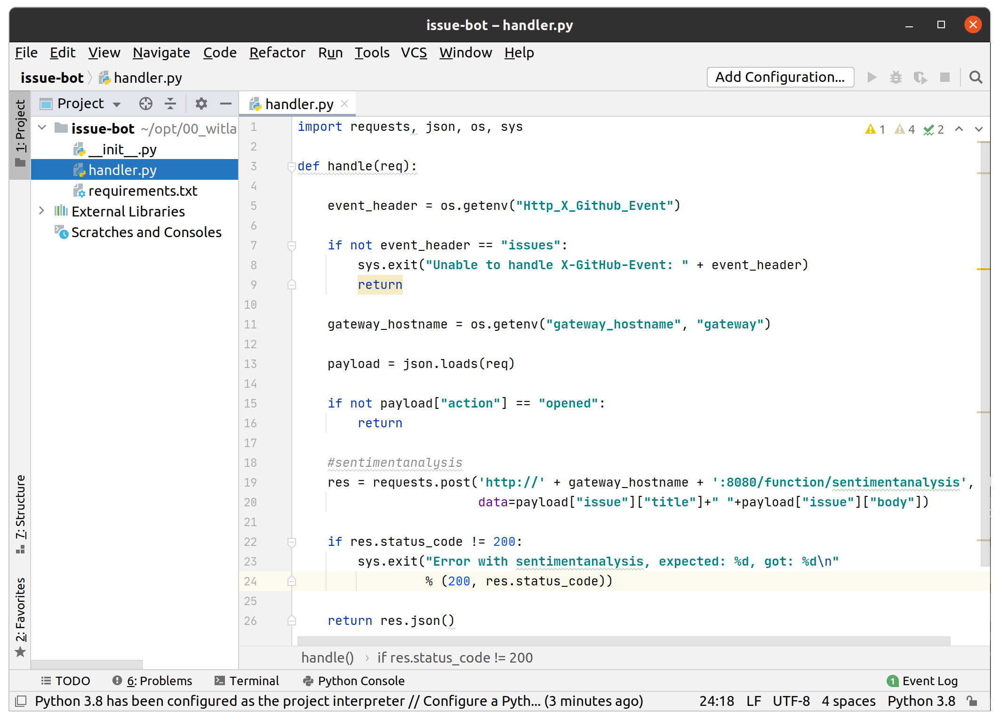

Update your `requirements.txt` file with the requests module for HTTP/HTTPs:

```
requests
```

Add `gateway_hostname` environment variable to `issue-bot.yml` file and set its value to  `gateway.openfaas.svc.cluster.local` for Kubernetes.
``` 
    ...
    environment:
      gateway_hostname: "gateway.openfaas.svc.cluster.local"
    ...
```

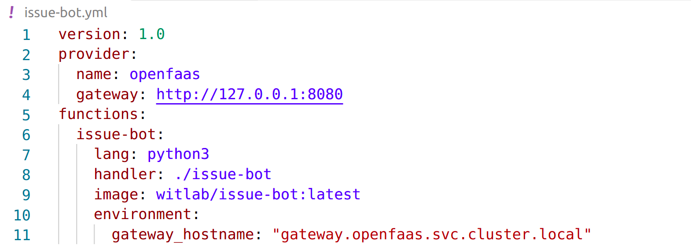

The following line from the code above posts the GitHub Issue's title and body to the `sentimentanalysis` function as text. The response will be in JSON format.

```python
res = requests.post('http://' + gateway_hostname + ':8080/function/sentimentanalysis', data=payload["issue"]["title"]+" "+payload["issue"]["body"])
```

* Build and deploy

Use the CLI to build and deploy the function:

```
$ faas-cli up -f issue-bot.yml
```

Now create a new issue in the `bot-tester` repository. GitHub will respond by sending a JSON payload to your function via the Ngrok tunnel we set up at the start.


You can view the request/response directly on GitHub - navigate to *Settings* -> *Webhook* as below:


## Respond to GitHub

The next step will be for us to apply a label of `positive` or `review`, but because this action involves writing to the repository we need to get a *Personal Access Token* from GitHub.

### Create a Personal Access Token for GitHub

Go to your *GitHub profile* -> *Settings/Developer settings* -> *Personal access tokens* and then click *Generate new token*.


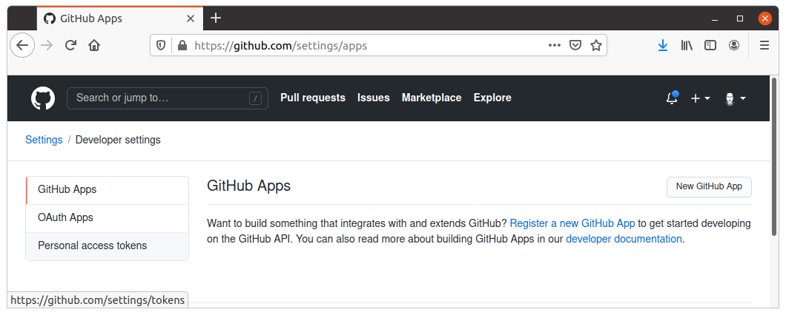

Tick the box for "repo" to allow access to your repositories


Click the "Generate Token" button at the bottom of the page

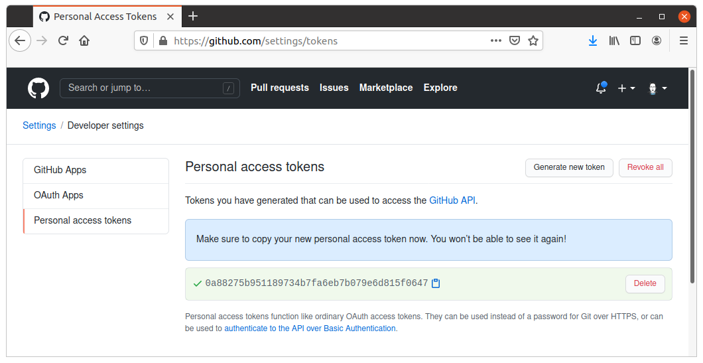

Create a file called `env.yml` in the directory where your `issue-bot.yml` file is located with the following content:

```yaml
environment:
  auth_token: <auth_token_value>
```


Update the `auth_token` variable with your token from GitHub.

Now update your issue-bot.yml file and tell it to use the `env.yml` file:

```yaml
provider:
  name: openfaas
  gateway: http://127.0.0.1:8080

functions:
  issue-bot:
    lang: python3
    handler: ./issue-bot
    image: <your-username>/issue-bot
    environment:
      write_debug: true
      gateway_hostname: "gateway.openfaas"
      positive_threshold: 0.25
    environment_file:
    - env.yml
```


> Note: If you're running on Kubernetes, suffix the `gateway_hostname` with `openfaas` namespace:
> ```
> gateway_hostname: "gateway.openfaas"
> ```

> The `positive_threshold` environmental variable is used to fine-tune whether an Issue gets the `positive` or `review` label.

Any sensitive information is placed in an external file (i.e. `env.yml`) so that it can be included in a `.gitignore` file which will help prevent that information getting stored in a public Git repository.

OpenFaaS also supports the use of native Docker and Kubernetes secrets, details can be found in [Lab 10](lab10.md)

### Apply labels via the GitHub API

You can use the API to perform many different tasks, the [documentation is available here](https://github.com/PyGithub/PyGithub).

Here's a sample of Python code that we could use to apply a label, but you do not add it to your function yet.

```python
issue_number = 1
repo_name = "erhwenkuo/issue_bot"
auth_token = "xyz"

g = Github("auth_token")
repo = g.get_repo(repo_name)
issue = repo.get_issue(issue_number)
```

This library for GitHub is provided by the community and is not official, but appears to be popular. It can be pulled in from `pip` through our `requirements.txt` file.

## Complete the function

* Update your `issue-bot/requirements.txt` file and add a line for `PyGithub`

```
requests
PyGithub
```


* Open `issue-bot/handler.py` and replace the code with this:

```python
import requests, json, os, sys
from github import Github

def handle(req):
    event_header = os.getenv("Http_X_Github_Event")

    if not event_header == "issues":
        sys.exit("Unable to handle X-GitHub-Event: " + event_header)
        return

    gateway_hostname = os.getenv("gateway_hostname", "gateway")

    payload = json.loads(req)

    if not payload["action"] == "opened":
        sys.exit("Action not supported: " + payload["action"])
        return

    # Call sentimentanalysis
    res = requests.post('http://' + gateway_hostname + ':8080/function/sentimentanalysis', 
                        data= payload["issue"]["title"]+" "+payload["issue"]["body"])

    if res.status_code != 200:
        sys.exit("Error with sentimentanalysis, expected: %d, got: %d\n" % (200, res.status_code))

    # Read the positive_threshold from configuration
    positive_threshold = float(os.getenv("positive_threshold", "0.2"))

    polarity = res.json()['polarity']

    # Call back to GitHub to apply a label
    apply_label(polarity,
        payload["issue"]["number"],
        payload["repository"]["full_name"],
        positive_threshold)

    return "Repo: %s, issue: %s, polarity: %f" % (payload["repository"]["full_name"], payload["issue"]["number"], polarity)

def apply_label(polarity, issue_number, repo, positive_threshold):
    g = Github(os.getenv("auth_token"))
    repo = g.get_repo(repo)
    issue = repo.get_issue(issue_number)

    has_label_positive = False
    has_label_review = False
    for label in issue.labels:
        if label == "positive":
            has_label_positive = True
        if label == "review":
            has_label_review = True

    if polarity > positive_threshold and not has_label_positive:
        issue.set_labels("positive")
    elif not has_label_review:
        issue.set_labels("review")
```


> The source code is also available at [issue-bot/bot-handler/handler.py](./issue-bot/bot-handler/handler.py)

* Build and deploy

Use the CLI to build and deploy the function:

```
$ faas-cli up -f issue-bot.yml
```

Now try it out by creating some new issues in the `bot-tester` repository. Check whether `positive` and `review` labels were properly applied and consult the GitHub Webhooks page if you are not sure that the messages are getting through or if you suspect an error is being thrown.

Let's create an issue with "negative" statement:

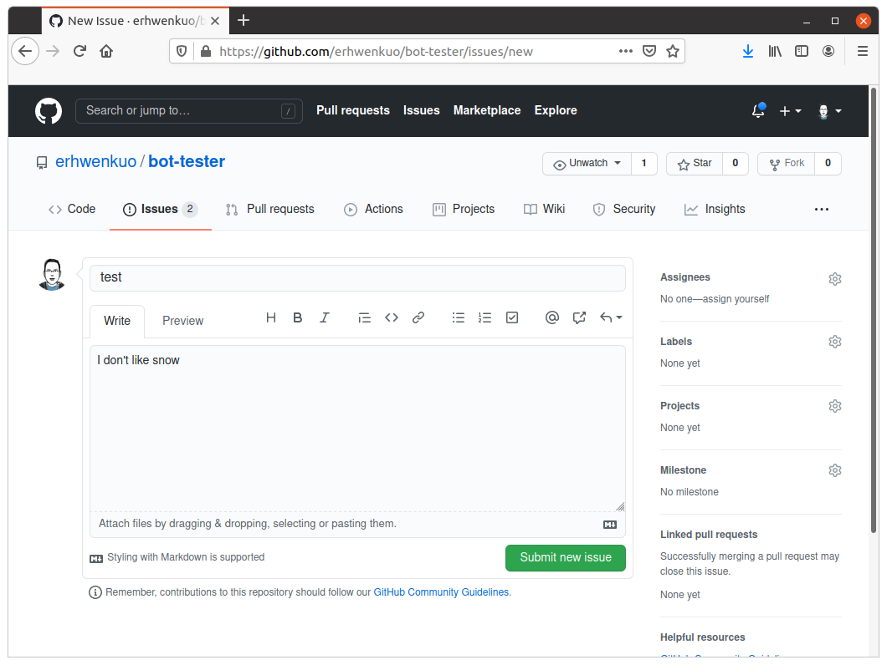

The result from our `issue-bot`:


Let's create an issue with "positive" statement:

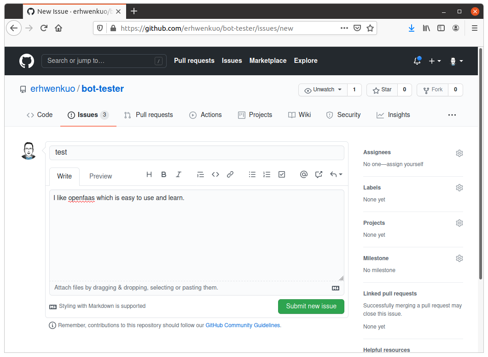

The result from our `issue-bot`:


> Note: If the labels don't appear immediately, first try refreshing the page

Now move on to [Lab 6](lab6.md).