# Lab 5 - Create a GitHub bot

[English version](lab5.md)

</img>

在開始本lab之前，請為在本機創建一個新檔案夾 `lab5`:

```
$ mkdir -p lab5 \
   && cd lab5
```

我們將使用OpenFaaS的function模版創建一個名為`issue-bot`的GitHub bot。

`issue-bot`的工作是通過分析在GitHub repo上所發出的"Issue"訊息裡"description"欄位的內容來做情感分析，然後將其標記為*positive*或*review*。這將有助於繁忙地repo維護人員有效安排工作規劃，經過標記之後他們可以優先考慮要首先解決的問題。

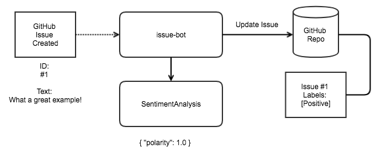

## Get a GitHub account

* 如果你還沒有一個[GitHub帳戶](https://github.com)，請註冊一個。

* 創建一個新的專案源碼存儲庫並將其命名為*bot-tester*。


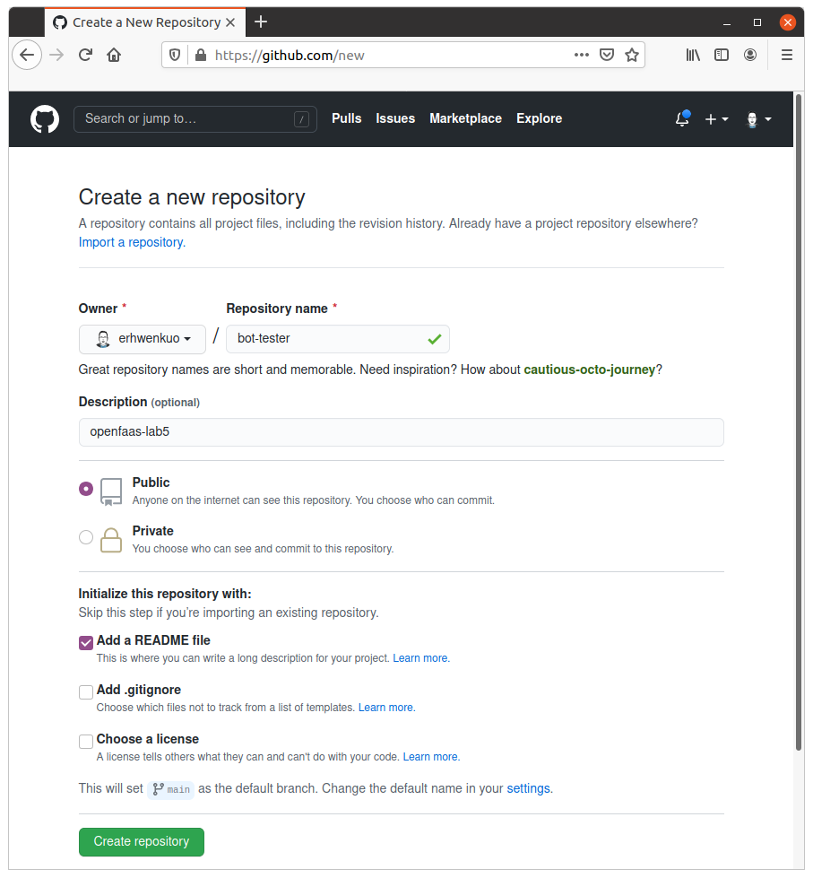

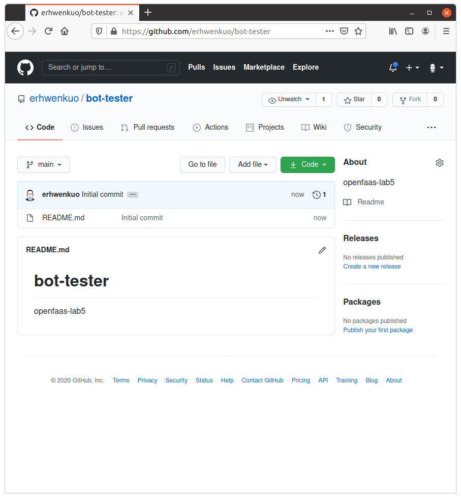

> 注意：我們只會將此存儲庫用作創建`Issue`的測試平台。你無需在此提交任何程式碼。

## Create a webhook receiver `issue-bot`

```
$ faas-cli new --lang python3 issue-bot --prefix="<your-docker-username-here>"
```


現在，編輯該function的YAML文件`issue-bot.yml`並添加一個環境變數`write_debug：true`：

```
provider:
  name: openfaas
  gateway: http://127.0.0.1:8080

functions:
  issue-bot:
    lang: python3
    handler: ./issue-bot
    image: <user-name>/issue-bot
    environment:
      write_debug: true
```


此時的`handler.py`就像是一個`echo` function:

```python
def handle(req):
    """handle a request to the function
    Args:
        req (str): request body
    """

    return req
```

* 使用以下命令構建，推送和部署功能

```
$ faas-cli up -f ./issue-bot.yml

[0] > Building issue-bot.
Clearing temporary build folder: ./build/issue-bot/
Preparing: ./issue-bot/ build/issue-bot/function
Building: witlab/issue-bot:latest with python3 template. Please wait..
Sending build context to Docker daemon  9.216kB
Step 1/29 : FROM openfaas/classic-watchdog:0.18.18 as watchdog
 ---> 8aa8fb60b8b9
Step 2/29 : FROM python:3-alpine

...
...
 ---> b5653cb5e8d6
Successfully built b5653cb5e8d6
Successfully tagged witlab/issue-bot:latest
Image: witlab/issue-bot:latest built.
[0] < Building issue-bot done in 0.17s.
[0] Worker done.

Total build time: 0.17s

[0] > Pushing issue-bot [witlab/issue-bot:latest].
The push refers to repository [docker.io/witlab/issue-bot]
d7f4bf09ab52: Mounted from witlab/hello-python 

...
...
latest: digest: sha256:3deb8d071f527768d46163a63d36a63d77dfe973f976abc105154ecd6bc1fea6 size: 4281
[0] < Pushing issue-bot [witlab/issue-bot:latest] done.
[0] Worker done.

Deploying: issue-bot.
WARNING! Communication is not secure, please consider using HTTPS. Letsencrypt.org offers free SSL/TLS certificates.

Deployed. 202 Accepted.
URL: http://127.0.0.1:8080/function/issue-bot.openfaas-fn
```


Testing the function using `curl`:

```sh
curl -X POST http://localhost:8080/function/issue-bot -d '{"test":"hello world"}'
```


Let's check the debug log:

```sh
$ kubectl logs deploy/issue-bot -n openfaas-fn
```


## Set up a tunnel with ngrok

你將需要從GitHub接收傳入的Webhooks。在生產環境中，你將為從互聯網進入的流量提供一條清晰的安全的route，但在workshop開發環境的網路限制相當的多，因此我們必需要發揮一點創造力。

我們將使用[ngrok](https://ngrok.com/)構建一條可連通互聯網進入的流量的安全http通道(tunneling)。請按照[Download & setup ngrok](https://ngrok.com/download)上的指示在本地計算機上安裝`ngrok`。

打開一個新的終端並輸入:

```
$ ngrok http 8080

ngrok by @inconshreveable                                              (Ctrl+C to quit)
                                                                                       
Session Status                online                                                   
Session Expires               7 hours, 58 minutes                                      
Version                       2.3.35                                                   
Region                        United States (us)                                       
Web Interface                 http://127.0.0.1:4040                                    
Forwarding                    http://134dbb8d227d.ngrok.io -> http://localhost:8080    
Forwarding                    https://134dbb8d227d.ngrok.io -> http://localhost:8080   
                                                                                       
Connections                   ttl     opn     rt1     rt5     p50     p90              
                              0       0       0.00    0.00    0.00    0.00 
```


`ngrok`提供免費的http網絡調試的通道，但是每個通道網路session僅能持續8個小時，另外每次重新執行`ngrok`時，流量轉發的URL都會改變。

基於`ngrok`的控制台，你應該能夠知道用於web hook的公共URL(範例: http://134dbb8d227d.ngrok.io)。

> 注意：`ngrok`提供的URL是動態的，請確保你找到自己的URL!

使用`curl`測試`ngrok`所提供的http通道:

```sh
curl -X POST http://134dbb8d227d.ngrok.io/function/issue-bot -d '{"test":"hello from ngrok"}'
```


## Receive webhooks from GitHub

重新登錄GitHub並導航到你的存儲庫*bot-tester*。

點擊 *Settings* -> *Webhooks* -> *Add Webhook*

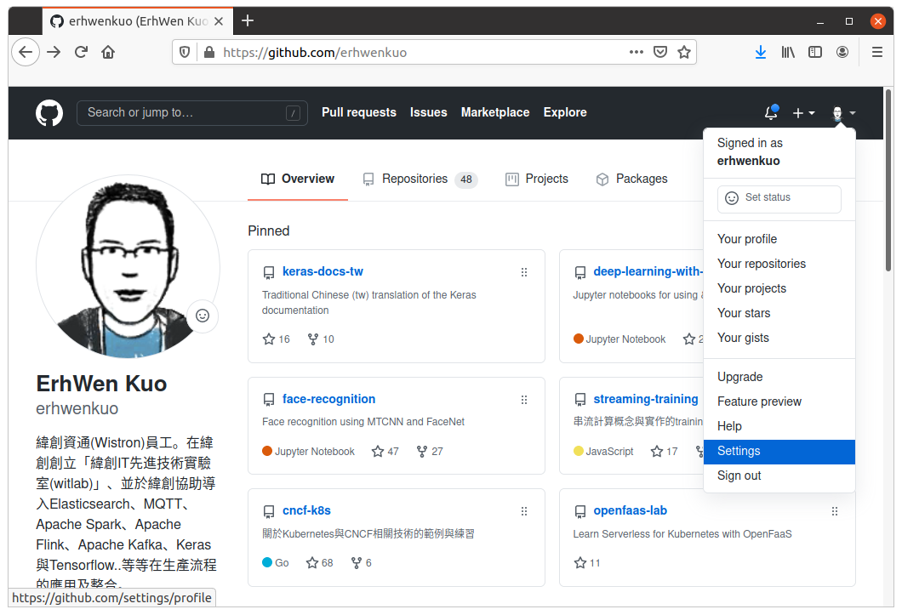


現在輸入你從`ngrok`得到的URL，在末尾添加`/function/issue-bot`，例如:

```
http://134dbb8d227d.ngrok.io/function/issue-bot
```

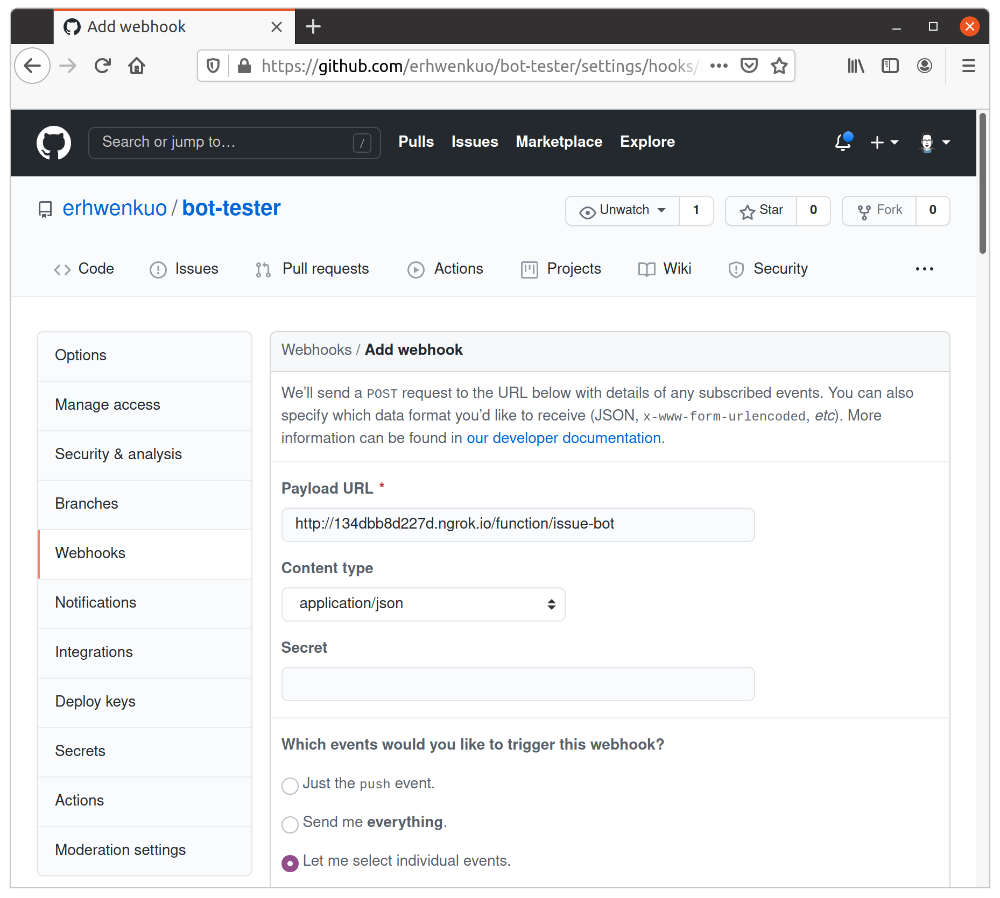

* 對於 *Content-type* 選擇: *application/json*

* 暫時對 *Secret* 放空白

* 選擇 "Let me select individual events"

* 選擇兩種events: **Issues** 與 **Issue comment**

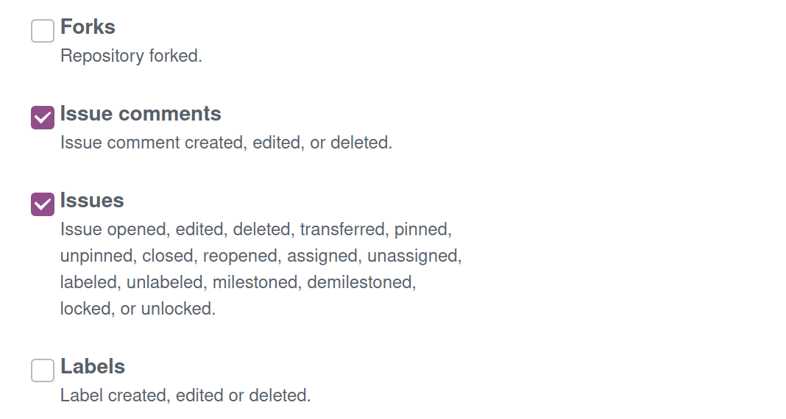


## Check it worked

現在轉到GitHub並創建一個新`Issue`。輸入"test"作為標題和描述。


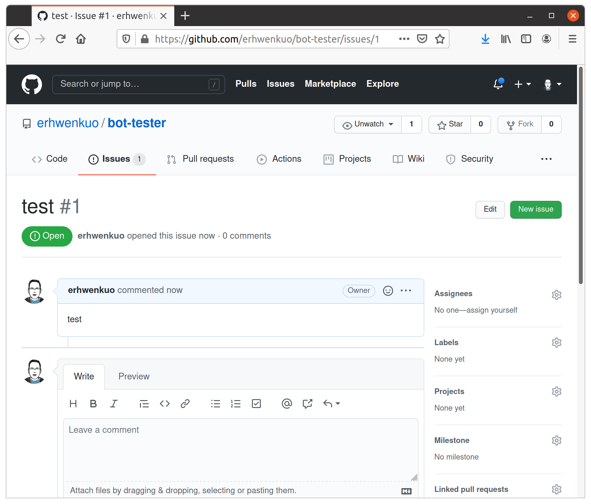

檢查該function被調用多少次-此數字應至少為1。

```
$ faas-cli list
Function    Invocations
issue-bot   2
```

每次你創建`Issue`時，GitHub的API會經由web hook來調用該function，因此調用計數將增加。

你可以通過鍵入以下內容查看通過GitHub發送的payload:

```sh
$ kubectl logs deployment/issue-bot -n openfaas-fn
```


GitHub Webhooks頁面還將在"Recent Deliveries"下顯示發送的所有事件消息，你可以在此處重送消息並查看function返回的響應。

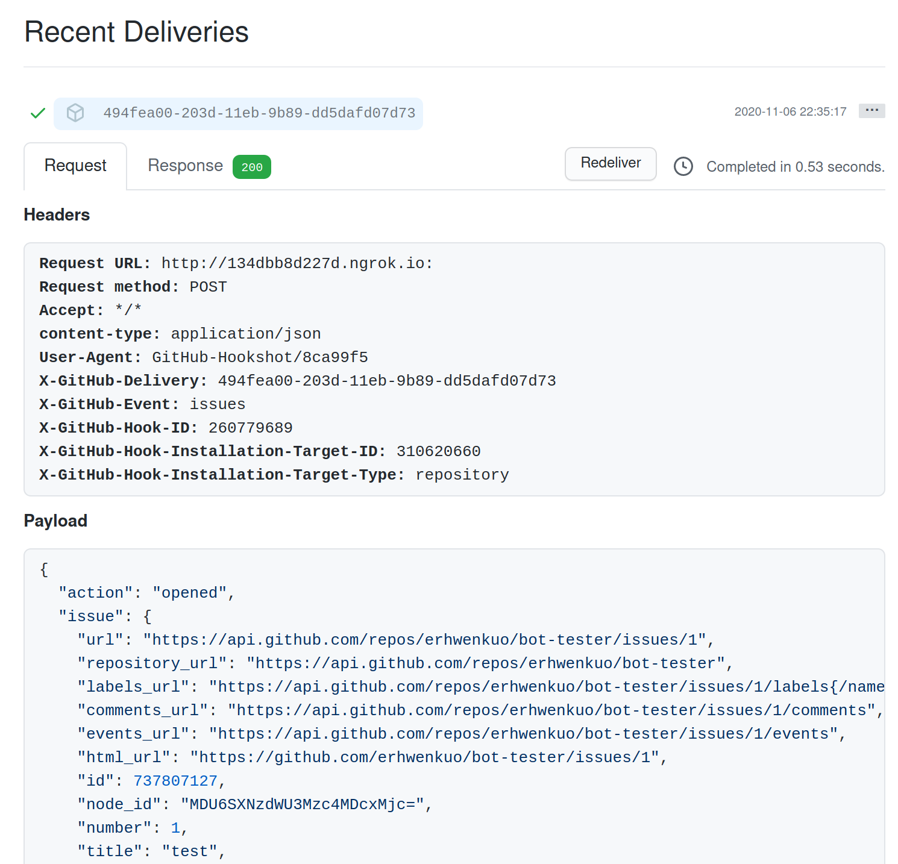

### Deploy SentimentAnalysis function

為了完成`issue-bot` function，你將需要先部署`SentimentAnalysis`的function。
這是一個python函數，可為針對每個句子提供的積極/消極(極性-1.0 ~ 1.0)和主觀性分析。

如果你沒有在[Lab 4](./lab4_zh-tw.md)中完成`SentimentAnalysis`的部署，那麼可以從**Function Store**中部署`SentimentAnalysis`。

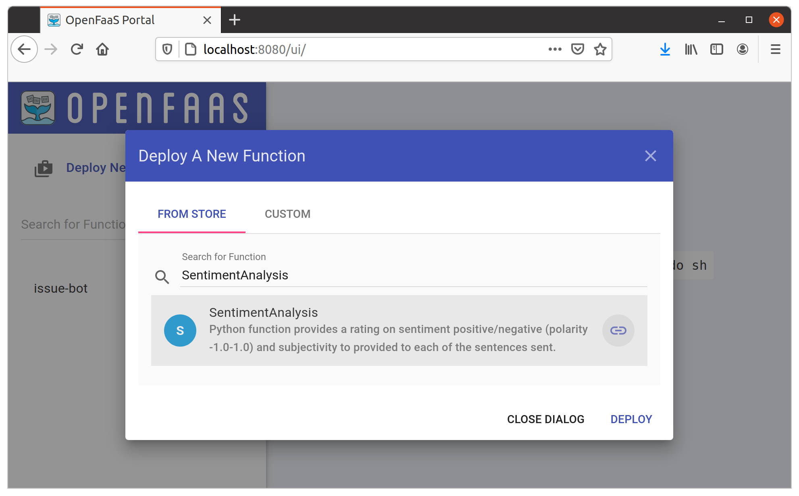

測試 `sentimentanalysis` function:

```
$ echo -n "I am really excited to participate in the OpenFaaS workshop." | faas-cli invoke sentimentanalysis

{"polarity": 0.375, "sentence_count": 1, "subjectivity": 0.75}

$ echo -n "The hotel was clean, but the area was terrible" | faas-cli invoke sentimentanalysis

{"polarity": -0.31666666666666665, "sentence_count": 1, "subjectivity": 0.8500000000000001}
```

### Update the `issue-bot` function

編輯 `issue-bot/handler.py` 並修改程式碼如下:

```python
import requests, json, os, sys

def handle(req):

    event_header = os.getenv("Http_X_Github_Event")

    if not event_header == "issues":
        sys.exit("Unable to handle X-GitHub-Event: " + event_header)
        return

    gateway_hostname = os.getenv("gateway_hostname", "gateway")

    payload = json.loads(req)

    if not payload["action"] == "opened":
        return

    #sentimentanalysis
    res = requests.post('http://' + gateway_hostname + ':8080/function/sentimentanalysis', data=payload["issue"]["title"]+" "+payload["issue"]["body"])

    if res.status_code != 200:
        sys.exit("Error with sentimentanalysis, expected: %d, got: %d\n" % (200, res.status_code))

    return res.json()
```


在`requirements.txt`文件加入用於叫用HTTP/HTTPs API的`requests`模組:

```
requests
```

在`issue-bot.yml`文件中添加`gateway_hostname`環境變數，並將值設置為`gateway.openfaas`。

``` 
    ...
    environment:
      gateway_hostname: "gateway.openfaas"
    ...
```


以下的程式碼將GitHub `Issue`的標題和正文作為文本發佈到`sentimentanalysis`函數中, 響應結果是JSON格式。

```python
res = requests.post('http://' + gateway_hostname + ':8080/function/sentimentanalysis', data=payload["issue"]["title"]+" "+payload["issue"]["body"])
```

* 構建和部署

使用CLI構建和部署function:

```
$ faas-cli up -f issue-bot.yml
```

現在`bot-tester` repository創建一個新的`issue`, GitHub將通過我們在一開始就設置的`ngrok`通道向你的函數發送`issue`事件。

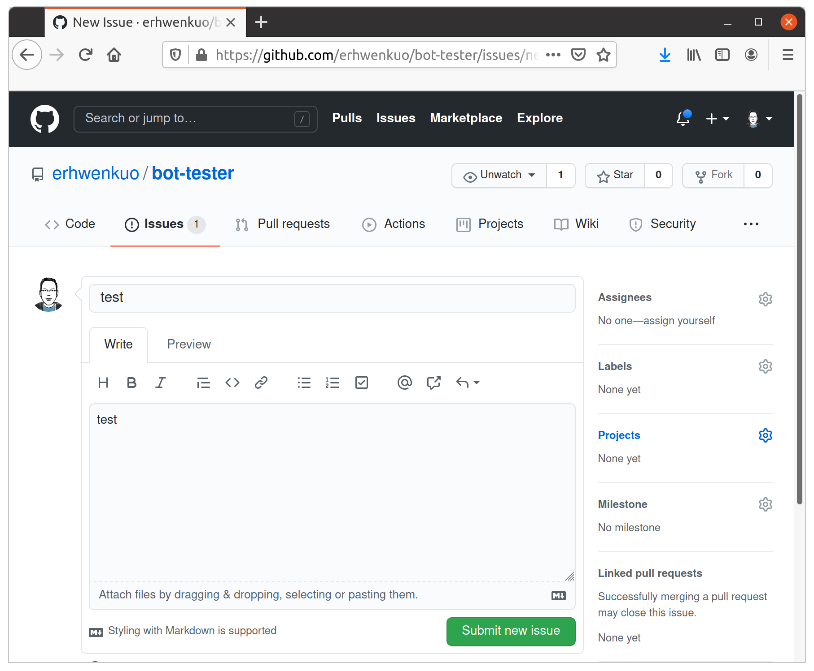

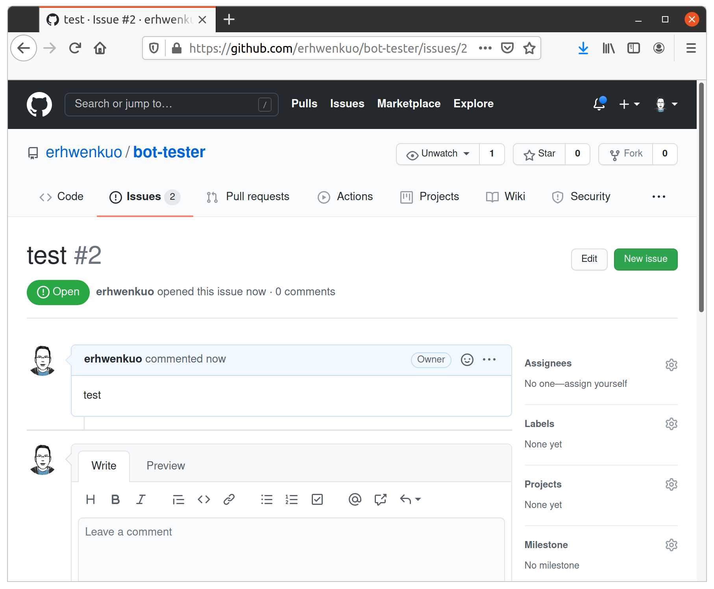

你可以直接在GitHub上查看request/response - 導航到 *Settings* -> *Webhook*，如下所示:

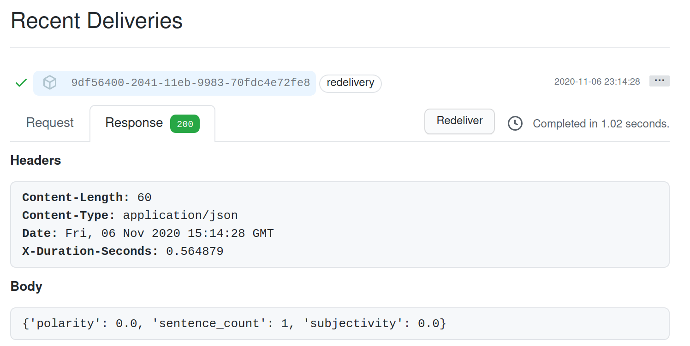

## Respond to GitHub

下一步將是我們對每一個Github的`issue`給了對予`positive`或`review`的標籤，但是由於此操作涉及寫入repository，因此我們需要從GitHub獲取*Personal Access Token*。

### Create a Personal Access Token for GitHub

導航到 *GitHub profile* -> *Settings/Developer settings* -> *Personal access tokens* 然然點擊 *Generate new token*。


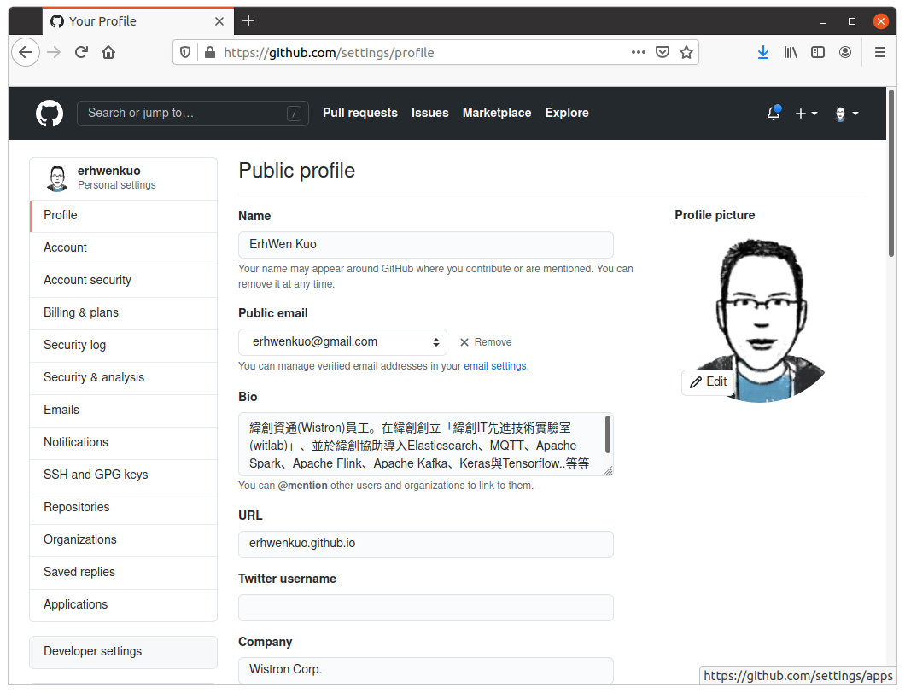


勾選"repo"，以允許訪問你的repository:

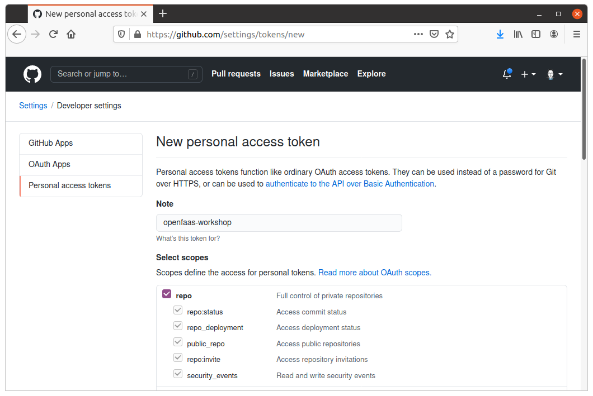

點擊頁面底部的"Generate Token"按鈕:


在你的`issue-bot.yml`文件所在的目錄中創建一個名為`env.yml`的文件，其內容如下:

```yaml
environment:
  auth_token: <auth_token_value>
```


使用來自GitHub的token並設置到`auth_token`變數。

現在更新你的`issue-bot.yml`文件，並告訴它使用`env.yml`文件:

```yaml
provider:
  name: openfaas
  gateway: http://127.0.0.1:8080

functions:
  issue-bot:
    lang: python3
    handler: ./issue-bot
    image: <your-username>/issue-bot
    environment:
      write_debug: true
      gateway_hostname: "gateway.openfaas"
      positive_threshold: 0.25
    environment_file:
    - env.yml
```

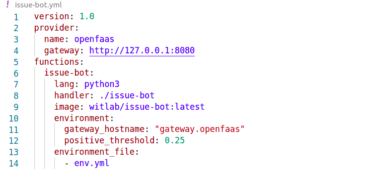

> `positive_threshold`環境變數是用於微調Issue是否獲得`positive`或`review`標籤的閥值。

將敏感信息放置在外部文件(如env.yml)中，以便可以將其包含在.gitignore文件中，這將有助於防止該信息存儲在公共Git存儲庫中。

OpenFaaS還支持使用Kubernetes secrets來儲存敏感信息, 詳細信息請參見[Lab 10](lab10_zh-tw.md)。

### Apply labels via the GitHub API

你可以使用[PyGithub](https://github.com/PyGithub/PyGithub) API​​執行許多不同有關Github repository的任務。

這是我們要用來apply標籤的Python範例程式碼:

```python
issue_number = 1
repo_name = "erhwenkuo/issue_bot"
auth_token = "xyz"

g = Github("auth_token")
repo = g.get_repo(repo_name)
issue = repo.get_issue(issue_number)
```

[PyGithub](https://github.com/PyGithub/PyGithub)函式庫是由社群所提供, 將它加入到我們的`requirements.txt`文件。

## Complete the function

* 更新你的 `issue-bot/requirements.txt` 檔案並加入`PyGithub`模組

```
requests
PyGithub
```

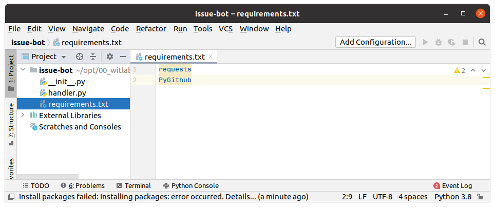

* 編輯 `issue-bot/handler.py` 如下所示:

```python
import requests, json, os, sys
from github import Github

def handle(req):
    event_header = os.getenv("Http_X_Github_Event")

    if not event_header == "issues":
        sys.exit("Unable to handle X-GitHub-Event: " + event_header)
        return

    gateway_hostname = os.getenv("gateway_hostname", "gateway")

    payload = json.loads(req)

    if not payload["action"] == "opened":
        sys.exit("Action not supported: " + payload["action"])
        return

    # Call sentimentanalysis
    res = requests.post('http://' + gateway_hostname + ':8080/function/sentimentanalysis', 
                        data= payload["issue"]["title"]+" "+payload["issue"]["body"])

    if res.status_code != 200:
        sys.exit("Error with sentimentanalysis, expected: %d, got: %d\n" % (200, res.status_code))

    # Read the positive_threshold from configuration
    positive_threshold = float(os.getenv("positive_threshold", "0.2"))

    polarity = res.json()['polarity']

    # Call back to GitHub to apply a label
    apply_label(polarity,
        payload["issue"]["number"],
        payload["repository"]["full_name"],
        positive_threshold)

    return "Repo: %s, issue: %s, polarity: %f" % (payload["repository"]["full_name"], payload["issue"]["number"], polarity)

def apply_label(polarity, issue_number, repo, positive_threshold):
    g = Github(os.getenv("auth_token"))
    repo = g.get_repo(repo)
    issue = repo.get_issue(issue_number)

    has_label_positive = False
    has_label_review = False
    for label in issue.labels:
        if label == "positive":
            has_label_positive = True
        if label == "review":
            has_label_review = True

    if polarity > positive_threshold and not has_label_positive:
        issue.set_labels("positive")
    elif not has_label_review:
        issue.set_labels("review")
```

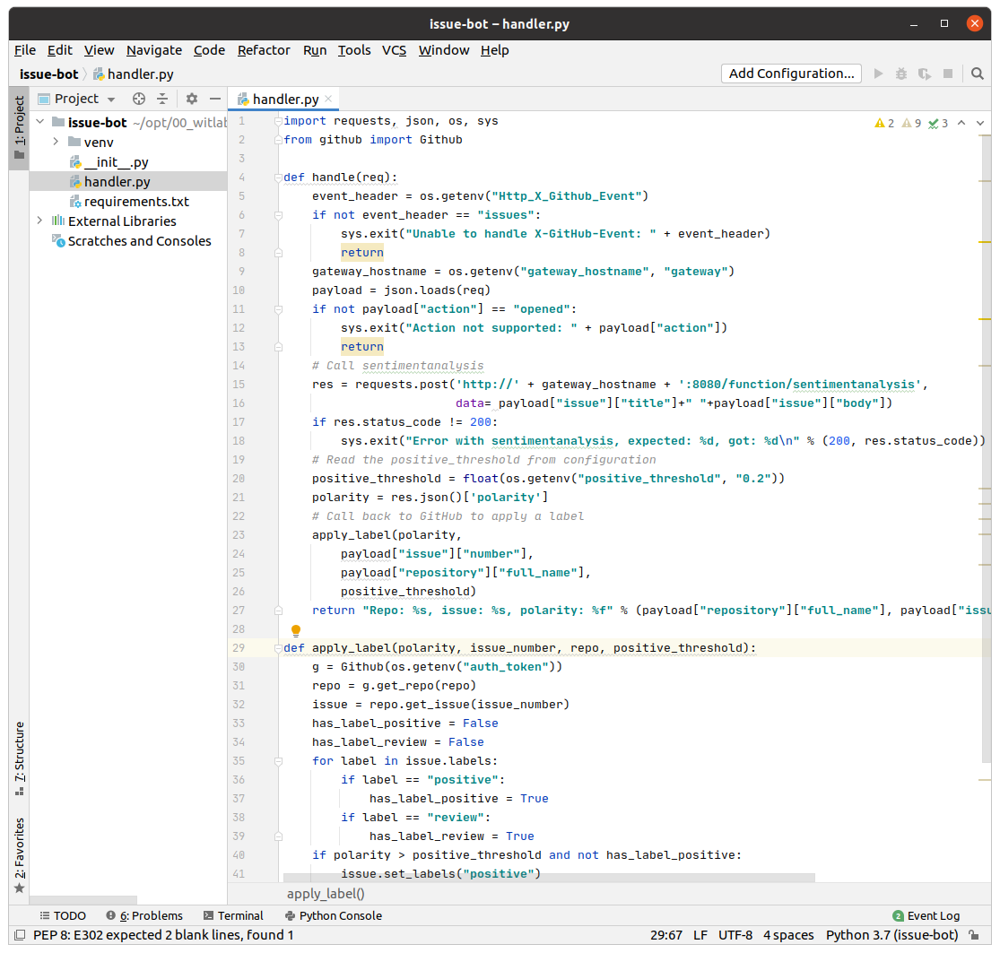

* 構建和部署

使用CLI構建和部署function:

```
$ faas-cli up -f issue-bot.yml
```

現在通過在`bot-tester` repository中創建一些新`issue`來進行試驗。如果不確定Github的事件消息是否己經通過你的function或懷疑有所錯誤，你可檢查`positive`和`review`標籤是否正確貼標或是查閱GitHub Webhooks頁面來追蹤事件歷程。

讓我們用"negative"語句來創建一個`issue`:


來自我們的`issue-bot`的結果:


讓我們用"positive"語句來創建一個`issue`:


來自我們的`issue-bot`的結果:


> 注意：如果標籤沒有立即顯示，請先嘗試刷新頁面

下一步 >> [Lab 6](lab6_zh-tw.md)