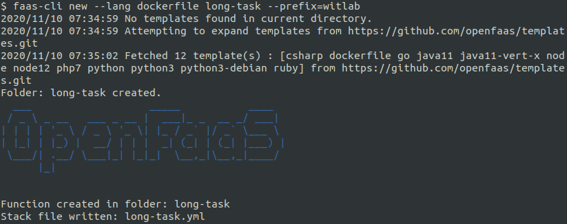
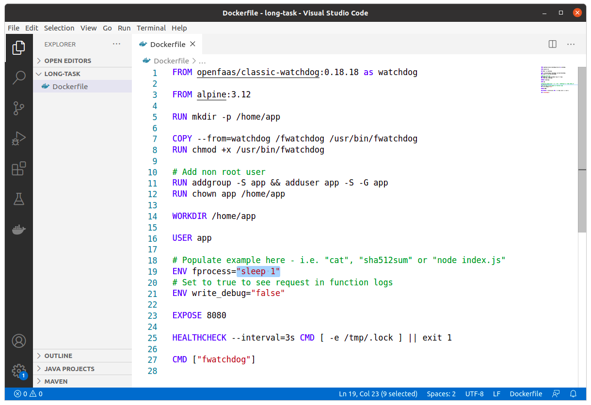
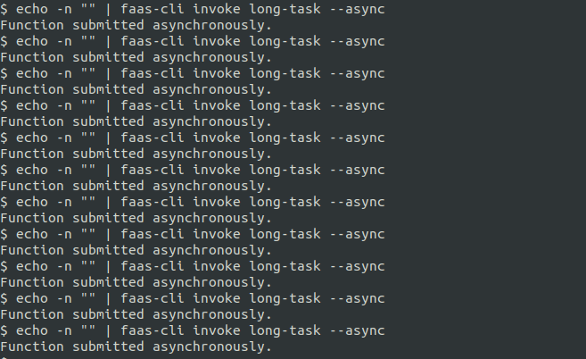
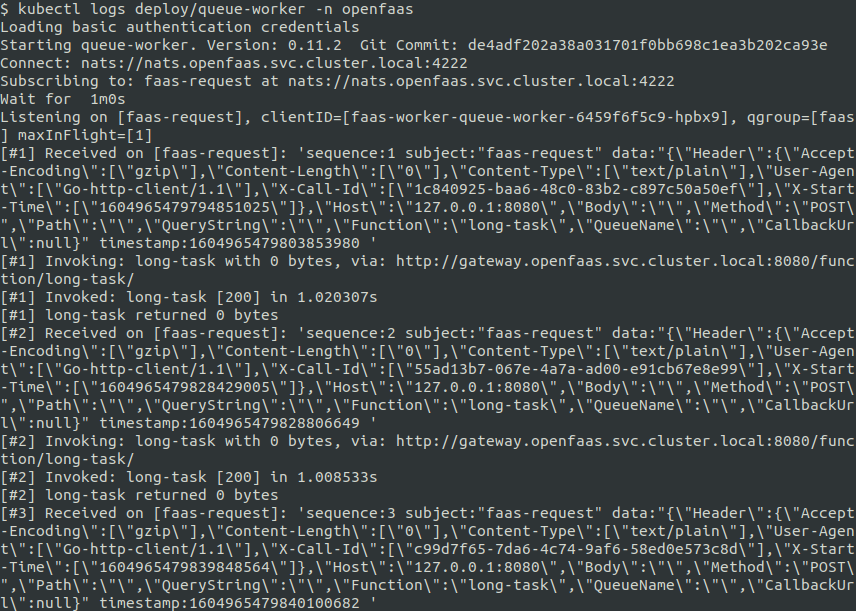
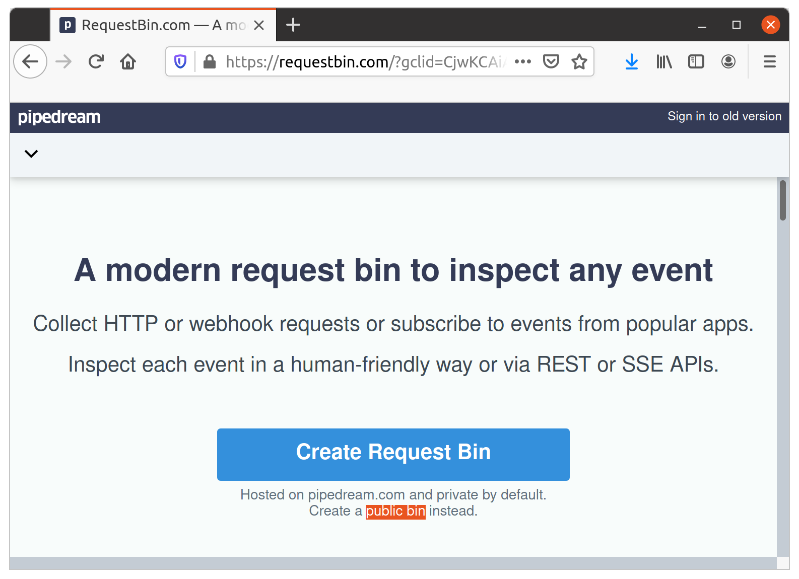
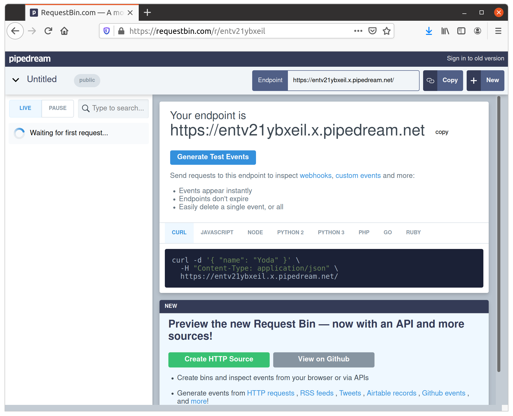

# Lab 7 - Asynchronous functions

[English version](lab7.md)

</img>

在開始本lab之前，請在本機創建一個新檔案夾 `lab7`:

```
$ mkdir -p lab7 \
   && cd lab7
```

## Call a function synchronously vs asynchronously

當你使用同步的方法調用一個function時，會建立一個tcp connection連接到OpenFaaS gateway，這個connection直至整個function回應結果之前都處於打開狀態。同步調用是“阻塞的(*blocking*)”，因此你應該看到客戶端暫停並變為非活動狀態，直到function完成其任務。

* OpenFaaS gateway使用這樣的route: `/function/<function_name>`
* 你必須等到function完成
* function完成後結果響應出來
* 這個時候你才知道function執行的結果是成功或是失敗

異步任務以類似的方式運行，但有一些區別:

* OpenFaaS gateway使用這樣的route: `/async-function/<function_name>`
* 客戶端從gateway獲得*202 Accepted*的立即響應
* OpenFaaS使用`queue-worker`來調用該function
* 預設的情況下，function執行的結果會被丟棄掉

讓我們嘗試一個快速演示。

```
$ faas-cli new --lang dockerfile long-task --prefix="<your-docker-username-here>"
```



編輯 `long-task/Dockerfile` 並且修改fprocess成為`sleep 1`.



> `sleep`是一個Unix的命令行程式，可以讓執行的程式小睡一段指定時間。

現在構建，推送和部署function:

```
$ faas-cli up -f long-task.yml

...
...
Deploying: long-task.

Deployed. 202 Accepted.
URL: http://127.0.0.1:8080/function/long-task.openfaas-fn
```

像下面這樣同步調用你的function10次:

```
echo -n "" | faas-cli invoke long-task
echo -n "" | faas-cli invoke long-task
echo -n "" | faas-cli invoke long-task
echo -n "" | faas-cli invoke long-task
echo -n "" | faas-cli invoke long-task
echo -n "" | faas-cli invoke long-task
echo -n "" | faas-cli invoke long-task
echo -n "" | faas-cli invoke long-task
echo -n "" | faas-cli invoke long-task
echo -n "" | faas-cli invoke long-task
```

現在異步調用該function10次:

```
echo -n "" | faas-cli invoke long-task --async
echo -n "" | faas-cli invoke long-task --async
echo -n "" | faas-cli invoke long-task --async
echo -n "" | faas-cli invoke long-task --async
echo -n "" | faas-cli invoke long-task --async
echo -n "" | faas-cli invoke long-task --async
echo -n "" | faas-cli invoke long-task --async
echo -n "" | faas-cli invoke long-task --async
echo -n "" | faas-cli invoke long-task --async
echo -n "" | faas-cli invoke long-task --async
echo -n "" | faas-cli invoke long-task --async
```



你觀察到了什麼? 第一個範例應該花10秒鐘左右才會全部完成，而第二個範例將在大約一秒鐘或更短的時間內返回到提示。這項工作仍需要10秒才能完成，但現在將被放入佇列中來推遲執行。

異步函數調用非常適合一些特定類型任務(這些任務，你可以將執行推遲到以後再執行，或者你不需要直接在同一個Request/Response的呼叫基礎上立即取得結果)。

> 一個很好的範例是從GitHub接收Webhooks時。

## View the queue-worker's logs

OpenFaaS使用[NATS Streaming](https://docs.nats.io/nats-streaming-concepts/intro)來實現工作佇例與執行推延。你可以使用以下命令查看日誌:

```
kubectl logs deployment/queue-worker -n openfaas
```



## Use an `X-Callback-Url` with requestbin

如果需要異步調用函數的執行結果，則你有兩種作法:
1. 修改程式碼來將結果通知某種遠方的端點或使用某種消息傳遞系統(比如,kafka)
2. 利用built-in的callbacks設計

第一個作法可能並不適合所有情況，並且涉及編寫額外的程式碼。
第二個選項則允許我們設定異步函數完成後要呼叫的callback或webhook的URL，`queue-worker`將通過這樣的手法來報告function執行成功或失敗的結果(好萊塢設計模式)。

有一些額外的request headers可送到callback中, 有關完整列表，請參見: [Callback request headers](https://docs.openfaas.com/reference/async/#callback-request-headers)。

為了模擬異步功能的webhook服務，我們將使用[requestbin](https://requestbin.com/) 服務來讓我們檢查我們異步執行的結果。

連結到[requestbin](https://requestbin.com/)並點擊"Create a [public bin](https://requestbin.com/r) instead"字句中的`public bin`來創建一個新的"bin"。



這將在互聯網上創建一個可以接收您的函數結果的URL。例如:`https://entv21ybxeil.x.pipedream.net`



> 就這個lab而言，請務必點擊"Create a [public bin](https://requestbin.com/r) instead"字句中的`public bin`這將使你不需要登錄就可試用。

現在複制"Bin URL"並設將它設定在"X-Callback-Url"標題信息上:

```
$ echo -n "LaterIsBetter" | faas-cli invoke figlet --async --header "X-Callback-Url=https://entv21ybxeil.x.pipedream.net"
```

現在檢查requestbin上的頁面，你將通過webhook來看到`figlet`執行的結果:

```
 _          _           ___     ____       _   _            
| |    __ _| |_ ___ _ _|_ _|___| __ )  ___| |_| |_ ___ _ __ 
| |   / _` | __/ _ \ '__| |/ __|  _ \ / _ \ __| __/ _ \ '__|
| |__| (_| | ||  __/ |  | |\__ \ |_) |  __/ |_| ||  __/ |   
|_____\__,_|\__\___|_| |___|___/____/ \___|\__|\__\___|_|   
                                                            
```


點擊左側菜單欄中的 "POST /":


> 專家提示：你還可以將另一個function用作`X-Callback-Url`-比如當處理異步工作執行結束後，通過Slack或Email通知相關人。要使用這個密技，請將`X-Callback-Url`設置為`http://gateway.openfaas:8080/function/<function_name>`。

下一步 >>  [Lab 8](lab8_zh-tw.md)